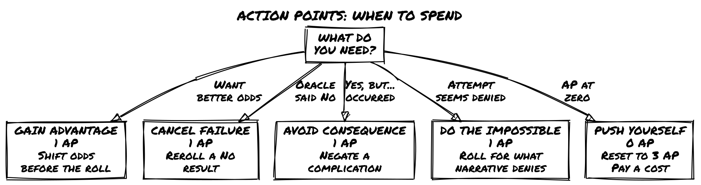
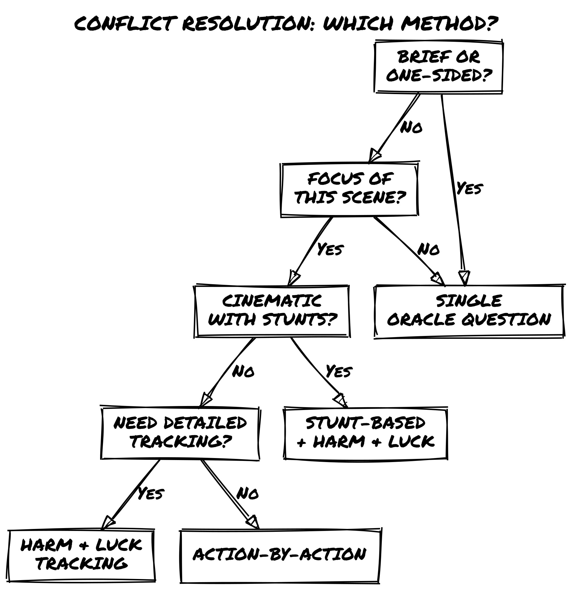
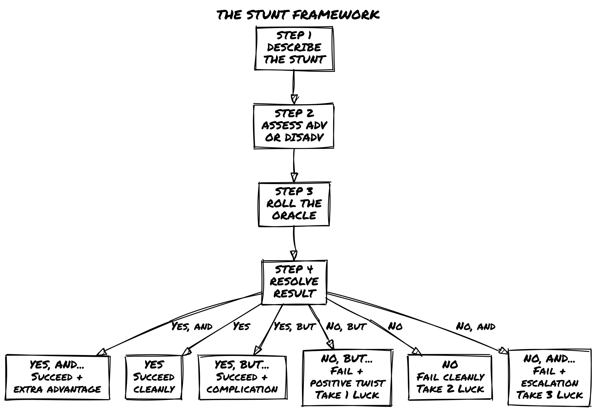
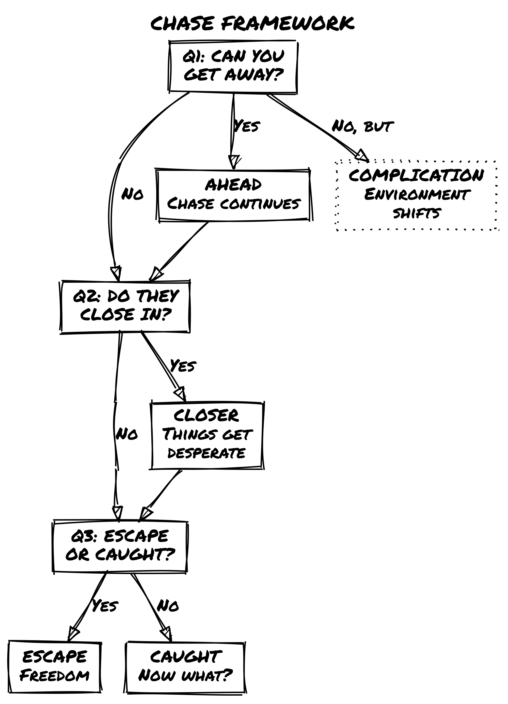
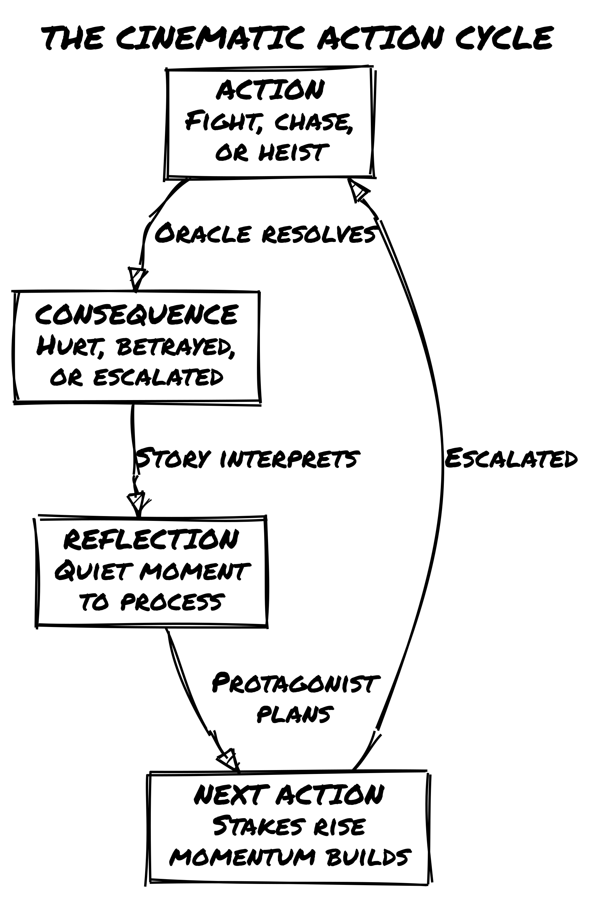

# Loner: Cinematic Action

## Introduction

You know that moment in a movie? The hero slides under a closing door, tumbles forward, springs to their feet, and launches into a kick that breaks three ribs and sends an enemy sprawling backward through a window. No physics, no hesitation, just pure cinematic magic.

That's what this book is about.

*Loner* is already an incredible system for solo RPG storytelling. The Oracle drives unpredictable narratives, tags let you describe anything without crunching numbers, and the minimalist approach keeps friction out of your fiction. But *Loner* is agnostic about tone. You can play it tense and tactical, slow and contemplative, or anything in between.

**This companion guide** is for when you want to play *Loner* at full cinematic throttle, where your protagonist leaps between rooftops, pulls off impossible stunts, and bends the laws of physics through sheer determination and style. It's for kung fu flicks, superhero spectacles, heist capers, and over-the-top action fantasies. It's for the moments where you ask: *"Can I do that?"* And the answer is: *"Hell yeah, roll and find out."*

None of these mechanics are mandatory. If the Oracle gives you a result that makes the scene better by ignoring the AP rules, ignore them. If a stunt should obviously succeed, let it succeed. The systems here are defaults, not laws.

### What This Book Offers

**Action Points** – A resource pool (3 per conflict) that lets you spend points for cinematic moments: gaining advantage, canceling failures, avoiding consequences, or attempting the impossible. Recovery comes once per adventure through the *Push Yourself* mechanic.

**The Stunt System** – A framework for character-defined, creative actions that push the boundaries of what's "realistic." Describe your stunt, roll the Oracle, and if you succeed, you win *spectacularly*.

**Enhanced Conflict Resolution** – Multiple approaches to fights, chases, and showdowns: single-roll quick resolutions, action-by-action breakdowns, or full attrition-based tracking with Harm & Luck. Choose the level of detail that fits your moment.

**Chase Mechanics** – Lightweight rules for pursuits that stay story-focused instead of getting bogged down in distance tracking. A few Oracle questions determine if you escape, get caught, or take an unexpected turn.

**Momentum & Pacing** – Tools for building cinematic tension through escalation, using your Twist Counter strategically, and knowing when to slam the brakes for a quiet moment of recovery.

**Genre Adaptations** – How these systems shift across kung fu, superhero, spy thrillers, heists, and more.

### What This Book Is NOT

This is not a replacement for *Loner*'s core rules. Everything in this guide is **optional**. You bolt it on when you want action to feel more cinematic. The core Oracle, the tag system, the minimalist approach: all of it stays exactly the same.

It's also not a detailed tactical combat system. If you want grid-based positioning and turn order and armor class calculations, this isn't your book. This is about **narrative action**, where the story moves fast, the stakes are high, and physics is negotiable.

Finally, it's not about group play. These rules are designed for solo storytelling. Some elements could be adapted for groups, but we're not going there.

### How to Use This Book

There's no strict reading order. Each chapter is mostly self-contained:

* Want to add **Action Points** to any game? Jump to Chapter 2.
* Need **Stunt rules** but nothing else? Chapter 4.
* Want to understand **cinematic philosophy**? Chapter 1 sets the tone.
* Planning a **kung fu game**? Chapter 8 has genre-specific tweaks.

You can mix and match. Use Action Points but skip the formal Chase mechanics. Use Stunts but handle conflicts with core Loner rules. The system is flexible. Make it yours.

### A Note on Cinematic License

This book is built on a simple philosophy: **If it makes for a good story, it's allowed.**

Real physics? Optional. Exhaustion mechanics? Not here. Fallible protagonists who make mistakes? Sure, but the Oracle decides, not probability. In cinematic action, the protagonist is the star, and the world bends around their choices, skills, and determination.

That doesn't mean consequences disappear. It means consequences feel *dramatic*. You're not worried about resource management; you're worried about whether you'll make it out alive, keep your cover, save the hostage, or survive what's coming next.

Let's build some cinematic magic.

## The Action Philosophy

Before we talk mechanics, let's talk philosophy.

*Loner* works because it gets out of your way. The rules are simple enough that they disappear, letting you focus on the story. When you add Action Points and Stunts and chase mechanics, we're not trying to make *Loner* complicated. We're trying to make **action feel cinematic**.

### What Makes Action Cinematic?

Cinematic action has specific qualities:

**1. The protagonist always has options.**

In a tight fight, your character doesn't just "roll to hit." They can try a risky stunt, burn an Action Point to gain advantage, or accept a consequence to achieve something impossible.

**2. Physics is in service of the story.**

Your protagonist slips through a closing security door, tumbles across a glass table, and lands on their feet firing. This violates every law of physics. Nobody cares. It *looks cool* and moves the story forward.

**3. Failure creates new complications, not dead ends.**

When your stunt fails, the scene escalates. An alarm triggers. An unexpected enemy shows up. The environment collapses differently than expected. Failure doesn't stop the story; it *twists* it.

**4. Style matters as much as success.**

Your protagonist can accomplish the same goal ten different ways. But how they do it, with style, swagger, clever thinking, or sheer determination, is what makes the story memorable. *Loner* cares about this because it cares about narrative.

**5. Momentum builds across scenes.**

Action doesn't exist in isolation. One victory feeds into the next challenge. A failed escape leads to capture, which leads to an interrogation, which leads to a dramatic reveal. Momentum builds, tension escalates, and the story accelerates.

### Cinematic vs. Tactical

Let's be clear about the difference.

**Tactical action** cares about positions on a grid, armor class, hit points, and turn order. It's strategic: can you outmaneuver your enemy? Do you have the right equipment? What's your formation?

**Cinematic action** cares about narrative and consequence. What *should* happen next? How does your choice affect the story? What makes for the best scene?

This guide focuses on **cinematic action**. That doesn't mean there are no tactics; there absolutely are. But tactics serve the narrative, not the other way around.

The Oracle still decides outcomes. You still use tags to describe advantages and disadvantages. You still roll dice to resolve uncertainty. The difference is that everything is framed around *what makes a good action scene*, not *what's mechanically optimal*.

### How to Maintain Loner's Minimalism While Adding Action

*Loner* is minimalist by design. Four six-sided dice, paper, pencil, tags, Oracle. That's all. Adding action mechanics could bloat this. We're not letting it.

Here's how we keep it lean:

**Every mechanic serves story, not simulation.** Action Points aren't resource management; they're narrative permission. You have 3 AP per conflict because 3 is enough to force real choices without feeling overwhelming.

**Mechanics use existing tools.** We're not inventing new subsystems. Action Points interact with Advantage/Disadvantage. Stunts use the Oracle. Chases use Oracle questions. You already know how to play; we're just giving you new ways to use the same tools.

**No math beyond d6 rolls.** You never track numbers beyond the d6 you're rolling. Luck is still 1-6. AP is still 1-3. Distance in a chase is still narrative ("close," "distant"). No calculation, no bookkeeping.

**Optional is the key word.** Don't like Action Points? Don't use them. Stunts feel gimmicky? Skip them. Play with just chases, or just Momentum pacing, or none of it. Everything here is bolt-on.

### When to Use These Mechanics vs. Core Loner

Here's a quick guide:

**Use core Loner rules (no action mechanics) when:**

* The conflict is brief or already decided.
* You want a quick resolution and narrative result.
* The scene is emotionally driven, not action-driven.
* You're playing a slower, more contemplative tone.

**Use Action Points when:**

* You want cinematic, multi-round action.
* Your protagonist has resources to spend on dramatic moments.
* You want to choose when to go all-in.

**Use Stunts when:**

* Your protagonist has a creative idea.
* They're trying something that shouldn't work but might.
* The description matters as much as the outcome.

**Use Harm & Luck when:**

* The conflict is **extended** and **high-stakes**.
* You want to track attrition and escalating danger.
* Enemies have their own Luck pool and stakes rise as both sides lose points.

**Use Chase mechanics when:**

* Someone is pursuing someone else.
* Escape, evasion, or capture is the core tension.
* The environment plays an active role.

### Setting-Agnostic Action

This guide works across any setting where action makes sense:

**Fantasy:** Dragon riders jousting in the sky. Sword duels on crumbling bridges. Wizards launching spells while dodging arrows.

**Sci-Fi:** Space station chases through zero-gravity. Hacking while under fire. Mech battles in city streets.

**Superhero:** Rooftop chases across a city. Powers clashing in impossible ways. Time limits before the bomb goes off.

**Spy/Tactical:** Gunfights through crowded streets. Undercover infiltrations with complications. Car chases on winding roads.

**Kung Fu:** Every fight is a stunt festival. Physics-defying martial arts. Enemies are obstacles to overcome creatively.

**Heist:** The plan goes sideways. Improvisation under pressure. Alarms, guards, and last-second pivots.

The mechanics stay the same; only the **flavor** changes. An Action Point spent for Advantage in a sword duel works exactly the same as an Action Point spent during a spaceship dogfight. A Stunt in a martial arts film follows the same Oracle roll as a Stunt during a heist escape.

### The Oracle Still Drives Everything

Here's the most important thing: **the Oracle is still in charge.**

When you roll Action Points and Stunts and Chases, the Oracle answers. Success isn't guaranteed because you're creative or because the movie would look cool. You roll. The Oracle decides. Reality, this story's reality, is determined by randomness and narrative sense in equal measure.

This keeps the game **emergent**. You can't guarantee your stunt succeeds. You can't buy your way past consequences with AP. You're negotiating with the Oracle, and sometimes the Oracle says *no*.

That's where the tension lives.

### Ready?

If you've read this far, you're ready. You understand that we're not replacing *Loner*; we're amplifying it toward cinematic action. We're keeping the minimalism, respecting the Oracle, and focusing on story.

Let's get into the mechanics.

## Action Points System Deep Dive

### What Are Action Points?

Action Points (or AP) are narrative resources. They represent moments of cinematic determination: when your protagonist decides to go all-in, bend luck in their favor, or attempt something that should be impossible.

You get **3 Action Points per conflict**. They don't refresh during a conflict; you spend them down. Once all 3 are gone, you play the rest of the conflict without them. Each conflict gives you a fresh 3 AP pool.

### The Four Ways to Spend Action Points

#### **Option 1: Gain Advantage (1 AP)**

Spend 1 AP to add an extra Chance die to your next Oracle roll.

Instead of rolling 1 Chance die and 1 Risk die, you roll 2 Chance dice and 1 Risk die (then keep the highest Chance die). This shifts the odds in your favor without guaranteeing success.

**When to use this:** You want better odds on something important. You're about to roll for a crucial stunt, a negotiation, or avoiding a trap. The 50/50 isn't good enough; you need the edge.

**Tag Cap interaction:** The core rules cap the dice pool at 2 Chance dice or 2 Risk dice maximum, regardless of how many tags apply. If you already have Advantage from tags (already rolling 2 Chance, 1 Risk), spending 1 AP for Advantage adds nothing. In that case, use the AP to cancel an active Disadvantage instead: the AP spend neutralizes one source of Disadvantage rather than adding a die. If no Disadvantage is active either, save the AP.

**Example:** Zahra is attempting to hack a security terminal with an alarm system. She asks the Oracle: *"Do I get past the security before it alerts?"* The situation is tough (Disadvantage from unfamiliar system), but she spends 1 AP for Advantage. She rolls 2 Chance dice and 1 Risk die (keeping highest Chance). This balances out the Disadvantage, giving her better odds.

#### **Option 2: Cancel a Failure (1 AP)**

Spend 1 AP to reroll an Oracle result that came up as a "No."

You asked the Oracle a yes/no question, it came up "No" (or "No, but..." or "No, and..."), and you're not happy with it. Spend 1 AP to immediately reroll that same question. The new result replaces the old one, and you *must* accept it, good or bad.

**When to use this:** You're desperate. A failure here has major consequences, and you're burning a resource to fight fate. Or you weren't ready for the outcome and need a second chance to process the scene.

**Important:** This isn't "cancel the consequence." You're rerolling the Oracle itself. If the new roll is still "No," that's your answer now. You committed.

**Example:** Zahra is attempting a rooftop jump between buildings in heavy rain. The Oracle says "No, and..." (she misses the jump and falls). Zahra spends 1 AP to reroll: *"Do I make the jump?"* New roll: "Yes, but..." (she makes it, but her hand slips on the landing). Much better.

#### **Option 3: Avoid a Consequence (1 AP)**

Spend 1 AP to negate a narrative consequence.

You succeeded (or failed), and as part of the resolution, a complication emerged. Your weapon jams. You triggered an alarm. You got spotted by a witness. An NPC enemy shows up. Spend 1 AP to erase that consequence from the scene.

**When to use this:** The consequence is worse than losing. You'd rather accept the base success/failure than deal with the new problem it creates.

**Example:** Zahra escapes a building complex (success!), but her escape route is blocked by security (consequence). She spends 1 AP to avoid the consequence: the guards don't show up, or they're distracted, or she finds an alternate route. She escapes clean.

#### **Option 4: Do the Impossible (1 AP)**

Spend 1 AP to attempt something that should automatically fail.

You want to do something narrative-breaking. Jump a motorcycle across a canyon. Dive off a building and grab a rope. Fight two opponents at once while protecting a hostage. Something that in a normal scene would get a flat "no."

Spend 1 AP, describe what you're attempting, and roll the Oracle.

**But here's the cost:** If you attempt the impossible, you *must* pay a narrative cost, regardless of success or failure. Something about your character, the scene, or the world changes as a consequence of this audacious act.

That cost is **yours to narrate**. Examples:

* You gain a **new Frailty** (*Exhausted*, *Wounded*, *Noticed by Enemies*).
* You **burn a Tag** temporarily (*that cool skill is strained and unreliable now*).
* **Circumstances escalate** (*the guards go on high alert*, *your cover is compromised*, *the building starts collapsing*).

**How to choose the cost:** If the attempt risks your body or identity, take a Frailty. If it strains a specific capability you relied on, burn a Tag. If the act itself changes the world around you, escalate circumstances. When in doubt, escalate; it keeps the story moving.

**Do the Impossible vs. Stunts:** A Stunt is a creative action you describe with flair; it doesn't cost AP, and any action can be a Stunt. Do the Impossible is an AP spend that grants you the right to *roll* for something the narrative would otherwise automatically deny. You can combine them: describe a Stunt and spend 1 AP to attempt it as an impossible act. When you do, both the stunt's Oracle roll and the AP's narrative cost apply.

**When to use this:** When you want to be the action hero. When you want that cinematic moment. When the story *needs* the impossible attempt, even if it might fail.

**Example:** Zahra is pinned by enemy fire. She wants to grab, against all odds, a pendant off a table across the room without getting shot. The situation is hopeless, but she spends 1 AP to attempt the impossible. She rolls against the Oracle. Success? She gets the pendant, but she takes a hit (Frailty: *Bleeding*). Failure? She doesn't get the pendant and gets hit worse (*Wounded* becomes *Severely Wounded*). Either way, the attempt itself carries cost.

### Push Yourself: Recovery Once Per Adventure

Once per adventure, you can spend your **Push Yourself** moment to recover 3 Action Points in the middle of a conflict. An adventure is a single story arc: one mission, one job, one investigation. When in doubt, treat it as one session of play. If an arc spans multiple sessions, Push Yourself resets at the start of each new session.

But it's not free. When you Push Yourself, you choose **one** of these consequences:

#### **Option A: Take a Serious Consequence**

Something genuinely bad happens. Not a minor complication; something with real narrative weight.

You're caught off-guard and take damage (gain a permanent Trait). You trigger a trap that wasn't supposed to be there. An NPC betrays you. An entire group of enemies arrives. The building collapses around you.

After choosing this consequence, you reset to 3 AP and can continue the conflict.

#### **Option B: Burn a Tag**

Temporarily or permanently remove one of your core identity tags.

Your Skill becomes unavailable (*that training is locked up, you can't access it right now*). Your Gear breaks or gets left behind. Your Concept shifts (*"Cunning" becomes "Desperate"*). Your Frailty worsens.

After burning the tag, you reset to 3 AP.

#### **Option C: Escalate the Situation**

Make the conflict harder, more dangerous, or more complex.

The one enemy becomes three enemies. The time limit shrinks. The environment becomes hostile. A subplot suddenly crashes into the main conflict. Something that was manageable becomes overwhelming.

You reset to 3 AP, but now you're playing on hard mode.

### Why These Trade-Offs Matter

**Push Yourself recovers 3 AP, but the cost is real.** You get 3 more Action Points in the middle of a conflict. That's huge. But the cost ensures it's a *choice*, not a free pass.

If taking a serious consequence is worth it, you take it. If burning a tag costs you more than the AP gains you, you accept losing the conflict. If escalating the situation makes the fight unwinnable, you have to ask: is getting those AP worth it?

That's the tension. That's the tension: choosing when to go all-in and what you're willing to sacrifice.

### Examples: Spending Action Points in Play

#### **Example 1: The Heist Infiltration**

Zahra is sneaking through a corporate facility. She's made it three rooms in without triggering an alarm. Now she's at the main server room, but there's a guard checkpoint between her and the door.

She asks the Oracle: *"Can I slip past the guard unnoticed?"*

**Roll:** Chance die (3), Risk die (4). Result: "No" (Risk is higher).

She doesn't like this. The mission depends on reaching the server. She has three options:

**Option 1 (Cancel Failure):** Spend 1 AP, reroll the same question.

New roll: Chance die (5), Risk die (2). Result: "Yes" (she gets past).

She moves forward, but she's used 1 of 3 AP.

Or...

**Option 2 (Do the Impossible):** Spend 1 AP, describe something wild.

> "I wait until the guard is distracted, then I run straight at him, vault over his desk, and do a forward roll into the server room while he's still processing what's happening."

She rolls: Chance (4), Risk (3). Result: "Yes, but..." (she succeeds, but the guard sees her; consequence).

Then she spends 1 AP to avoid the consequence: the guard's radio is broken, or he hesitates, or something else prevents the alarm. She's in the server room, clean, but she's used 2 AP and a consequence-avoidance.

#### **Example 2: A Duel Gone Wrong**

Zahra is fighting a skilled opponent. They've traded blows for several rounds. Zahra's hurt (has taken Luck damage), and her opponent still looks strong.

She's on her third round of the fight. She has only 1 AP left (she spent 2 in earlier moments). The Oracle determines that her opponent is about to land a serious hit.

She could accept it: take the Luck loss, and keep fighting. Or she could get creative:

**Option (Do the Impossible with Push Yourself):** *"I throw sand in his eyes, grab the chandelier above us, and swing across the room while he's blinded, getting distance and repositioning."*

The Oracle determines this needs a roll. She rolls: Chance (2), Risk (5). Result: "No, and..." (not only does it fail, but he anticipates her move and closes the distance faster).

But this "Do the Impossible" moment hits her hard. She decides to trigger **Push Yourself**:

She chooses **Escalate the Situation:** His reinforcements arrive just as her distraction fails. Now she's facing three opponents instead of one.

She resets to 3 AP, but the fight just became a lot harder.

#### **Example 3: A Chase**

Zahra is fleeing on foot through a crowded market. An enemy is chasing her. She has 2 AP remaining.

She sees an opportunity: a rope hanging from a canopy, a vendor's stall to jump over, a fountain to run through. She wants to attempt a cinematic escape, something that will look cool and might give her distance.

She describes a stunt: *"I grab the rope, swing over the vendor stall, and drop behind the fountain. The angle means he loses sight of me for a moment."*

Oracle roll for the stunt: Chance (4), Risk (4). Result: "Yes, but..." (she does it, but she lands hard; consequence: minor injury).

She could accept the consequence, or spend 1 AP to avoid it. She spends 1 AP (now at 1 AP remaining). She's further ahead, no injury, but her AP is almost gone.

### Action Points: Quick Reference



| Action                | Cost            | What It Does                                                           |
|-----------------------|-----------------|------------------------------------------------------------------------|
| **Gain Advantage**    | 1 AP            | Roll 2 Chance dice, 1 Risk die; keep highest Chance                    |
| **Cancel a Failure**  | 1 AP            | Reroll a "No" result on the same Oracle question                       |
| **Avoid Consequence** | 1 AP            | Erase a narrative complication from a success/failure                  |
| **Do the Impossible** | 1 AP            | Roll for something that should auto-fail; pay narrative cost           |
| **Push Yourself**     | 1 use/adventure | Recover 3 AP, but choose: serious consequence, burn a tag, or escalate |

### Design Insight: Why Action Points Work

Action Points work because they solve a specific problem: **cinematic uncertainty.**

In a regular *Loner* conflict, you roll the Oracle and accept the result. "No" happens. Sometimes it's narratively perfect. Sometimes it sucks. You move on.

But in action stories, that randomness can feel anticlimactic. Your hero attempts something cool and the Oracle says *no*. Your stunt fails. Your escape is thwarted.

Action Points let you say: *"This moment matters. I'm willing to pay for it."*

You're not guaranteed success; the Oracle still rolls, and you might fail anyway. But you have a tool for moments that deserve a second roll, a better outcome, or the chance to be impossible.

And because you only have 3 per conflict, every AP matters. You can't spam them. You have to choose: is this moment worth it? Do I use this resource here, or do I save it for the big moment coming up?

That's the constraint that makes every AP spend a real decision.

## Conflict Resolution Methods

A conflict in *Loner* can be resolved in many ways. The level of detail, the systems you use, and the pacing all depend on **what the scene needs**.

This chapter gives you a decision tree for choosing the right approach.

### The Five Resolution Methods

#### **Method 1: Single Oracle Question (Lightning Fast)**

Ask **one** closed question about the entire conflict and resolve it in a single roll.

*"Do I win this fight?"* / *"Can I escape before they catch me?"* / *"Does my disguise hold up?"*

Oracle rolls. You get a yes/no (with modifiers). Scene resolved. Move on.

**When to use:** The conflict isn't the focus of the scene. You're more interested in the consequence than the action itself. You want to move the story forward without dwelling on combat mechanics. The conflict is brief or one-sided.

**Example:** Zahra is cornered by three guards. She doesn't want a drawn-out fight. She asks: *"Can I intimidate them into standing down?"* Oracle says "No, but..." They don't back off, but one of them hesitates, creating an opening. She runs. Conflict done in one roll.

#### **Method 2: Action-by-Action (Moderate Detail)**

Instead of one big question, break the conflict into **individual actions**. Each action is its own Oracle roll.

You describe what you do. You roll. The Oracle answers. Your opponent (or circumstance) reacts. You describe your next action. Repeat until the conflict reaches a natural end.

**When to use:** The conflict is important but not prolonged. You want to see how it unfolds, action by action. There's uncertainty and tension, but you're not tracking every hit or injury.

**Example:**

*"I try to disarm the guard."* Oracle: Yes, but... (I disarm him, but he shouts for backup)

*"I kick him toward the stairs."* Oracle: No, but... (He resists, but I gain position)

*"I move toward the exit."* Oracle: Yes, and... (I reach the door and spot a second guard approaching)

Each action is a question. Each roll informs the next. The scene unfolds dynamically.

#### **Method 3: Harm & Luck Tracking (Extended, Detailed)**

You're tracking **Luck loss**. Both you and your opponent have 6 Luck. Whoever reaches 0 loses the conflict.

Each Oracle roll determines how much Luck damage happens:

* **Yes, and...** = Deal 3 Luck damage
* **Yes...** = Deal 2 Luck damage
* **Yes, but...** = Deal 1 Luck damage
* **No, but...** = Take 1 Luck damage
* **No...** = Take 2 Luck damage
* **No, and...** = Take 3 Luck damage

You continue rolling until one combatant reaches 0 Luck. The conflict ends, and you interpret what reaching 0 means (captured, knocked out, forced to retreat, etc.).

**Setting enemy Luck:** All enemies start at 6 Luck, same as the protagonist. Threat level comes from tags, not pool size. A minion with no relevant tags means most of your rolls have Advantage; a boss with strong tags means most of yours have Disadvantage. The pool is the same. The difficulty isn't.

**Multiple enemies:** Treat a group of similar enemies as one unit sharing a single 6-Luck pool. Treat named or distinct enemies as individual combatants. You decide which enemy your actions target; enemies act as a unit against you.

**Boss phases (optional):** For final antagonists or named enemies who shouldn't fall in a single exchange, use phases. When the boss reaches 0 Luck, they don't fall — they escalate. Reset their Luck to 6 and add or intensify one of their tags to reflect the new phase (*Cornered and Desperate*, *Revealing True Power*, *Calling Reinforcements*). Each phase makes the fight harder. Use 2–3 phases for a climactic confrontation; one phase for a strong named rival.

**When to use:** The fight is central to the scene. There's real danger and attrition. You want to feel the danger mount as both sides take damage. The opponent is a true threat.

**When NOT to use:** The fight is obviously one-sided. The scene doesn't need prolonged tension.

**Example:** Zahra vs. a skilled rival in a proper duel.

Zahra: 6 Luck / Rival: 6 Luck

*"Do I land a solid hit?"* Oracle: Yes, but... (I hit, but he anticipated and counters) → Zahra deals 1 damage (Rival now 5)

*"Does his counterattack connect?"* Oracle: Yes, and... (hits hard and presses advantage) → Zahra takes 3 damage (Zahra now 3)

The fight escalates. Every round, Luck ticks down. The tension builds because both sides are getting hurt.

#### **Method 4: Stunt-Based (Cinematic, Oracle-Driven)**

You describe a **stunt**, a creative, over-the-top action. You roll the Oracle. If you succeed, the stunt works and grants narrative advantage. If you fail, you lose Luck or trigger a consequence.

Stunts are the playground of Action Points + Harm & Luck. You're using all three systems together: describing cool actions, rolling the Oracle, and tracking Luck loss.

**When to use:** You want cinematic action where creativity is rewarded. You're using Action Points to gain advantage or avoid consequences. The stunt itself is as important as the outcome.

**Chapter 4 (The Stunt System) goes into detail here.**

#### **Method 5: Hybrid (Mixing Methods)**

You might use different methods in the same conflict.

Start with **action-by-action** questions to build tension. Once a clear threat emerges, switch to **Harm & Luck tracking**. Mid-fight, describe a **stunt** and roll for it. If things look bad, ask a single **oracle question** to see if you can escape.

**When to use:** Extended, complex conflicts with multiple phases. The conflict has natural stages (chase, fight, escape) that each need different resolution styles.

**Example:** Zahra infiltrates a building, gets spotted, runs, gets chased, fights her pursuers, and attempts a desperate escape.

1. Infiltration = action-by-action
2. Chase = simple oracle questions + stunt (the jump)
3. Fight = Harm & Luck tracking
4. Escape = stunt attempt

Each phase uses the method that fits.

### Making the Choice: A Decision Tree



```
Is the conflict brief or obviously one-sided?
├─ YES → Use Single Oracle Question
└─ NO → Is the conflict the focus of this scene?
    ├─ NO → Use Single Oracle Question
    └─ YES → Is it cinematic action with stunts?
        ├─ YES → Use Stunt-Based (with Harm & Luck)
        └─ NO → Does it need detailed tracking?
            ├─ YES → Use Harm & Luck Tracking
            └─ NO → Use Action-by-Action
```

### Combining Methods: Action Points + Harm & Luck

Remember: **you use both systems together** in extended conflicts.

* **Action Points** let you gain advantage, avoid consequences, cancel failures, or attempt the impossible.
* **Harm & Luck** tracks damage and tells you when the conflict is over.

In a single fight, you might:

1. Spend 1 AP for Advantage on an important roll
2. Roll the Oracle for a stunt
3. Track Luck loss from the result
4. Use "Avoid Consequence" AP to negate a complication
5. Eventually lose all Luck and lose the conflict

Both systems are **active the entire time**.

### When Luck Runs Out

Reaching 0 Luck doesn't automatically mean death. It means **the conflict is decided**, and the story must interpret what that means.

**In a fight:** You're knocked out, disarmed, pinned, or forced to retreat.

**In a chase:** You're caught, cornered, or lose the target.

**In a negotiation:** You're talked down, convinced to back off, or forced into agreement.

**In a heist:** You trigger an alarm, get spotted, or your cover is blown.

The **Oracle and narrative** determine the exact consequence.

### Quick Decision Guide

| Conflict Type               | Best Method            | Why                                 |
|-----------------------------|------------------------|-------------------------------------|
| Brief, one-sided            | Single Oracle Question | Fast resolution                     |
| Important but not prolonged | Action-by-Action       | Scene unfolds action by action      |
| Extended, high-stakes       | Harm & Luck            | Tension through attrition           |
| Creative, cinematic         | Stunt-Based            | Style + Oracle                      |
| Multi-phase complex         | Hybrid                 | Different stages, different methods |

## The Stunt System

A **stunt** is a character-defined creative action, something cinematic, bold, or unexpected that pushes the boundaries of "realistic."

Stunts are the heart of cinematic action. They're where your protagonist does things that *shouldn't work but might*.

### What Makes a Stunt?

A stunt has these qualities:

**1. It's described first.**

Before you roll, you *describe* what you're doing. Not "I attack," but *"I throw a punch at his face while simultaneously kicking the table leg to make him stumble."* Detail matters. Creativity matters.

**2. It has clear stakes.**

If it succeeds, something good happens: you gain advantage, bypass an obstacle, or achieve something impossible. If it fails, there's a real cost (Luck loss, consequence, escalation).

**3. It requires an Oracle roll.**

You always roll to determine if the stunt works. No auto-success. The Oracle decides.

**4. Success grants narrative benefit beyond normal success.**

A normal success might let you win a fight. A successful stunt lets you win *with style*: gaining position, disarming an opponent, impressing an NPC, or creating a new opportunity.

### The Stunt Framework

#### **Step 1: Describe the Stunt**

You describe what you're doing. Be specific. Be visual.

❌ *"I do a move."*
✅ *"I leap off the railing, plant my feet on a barrel mid-fall, and spring sideways onto the moving cargo train."*

The description doesn't affect the roll (the Oracle doesn't care how cool it is). But it affects how you narrate success or failure. A cool description deserves cool interpretation.

**Quick test:** If your action has more than one moving part, or if the style of execution matters as much as whether it succeeds, treat it as a Stunt. Single-part actions (*"Do I hit him?"*) are regular Oracle rolls. Multi-part or style-dependent actions are Stunts.

**Stunts don't cost AP.** You can attempt any creative action for free. Spend 1 AP (Do the Impossible) only when the action would be denied outright before a roll; the narrative itself says "that can't happen." If there's any reasonable chance it could happen, it's just a Stunt.

#### **Step 2: Assess Advantage/Disadvantage**

Based on your tags and the situation, does the stunt have Advantage or Disadvantage?

* **Advantage:** You have a relevant tag, the environment helps, or you've set it up well.
* **Disadvantage:** The situation opposes you, you lack relevant tags, or you're improvising.
* **Neutral:** Even stakes.

Remember: you can spend 1 AP to gain Advantage if you want to shift the odds.

#### **Step 3: Roll the Oracle**

Ask a closed question about whether the stunt succeeds: *"Does my stunt work?"* / *"Can I land this move?"* / *"Do I successfully escape across the rooftops?"*

Roll 1 Chance die, 1 Risk die (adjust for Advantage/Disadvantage).

#### **Step 4: Resolve Based on Result**

**"Yes, and..."**
Your stunt succeeds spectacularly. You accomplish the goal and gain **extra advantage**. You disarm your opponent *and* position yourself for a follow-up. You escape *and* steal something valuable. You impress the NPC *and* they offer help.

Cost: None (beyond spending AP if you used it).

**"Yes..."**
Your stunt works exactly as described. You achieve the goal cleanly.

Cost: None (beyond spending AP).

**"Yes, but..."**
Your stunt succeeds, but with a complication. You cross the gap, but you're wounded. You dodge the attack, but you're off-balance. You distract the guard, but he calls for backup.

Cost: You can spend 1 AP to avoid the consequence, or accept it as part of the success.

**"No, but..."**
Your stunt fails, but something positive happens anyway. You can't disarm him, but you do create distance. You fall, but you grab a ledge. You're detected, but you spot an alternate route.

Cost: You can pivot to the positive outcome or accept a failure. Take 1 Luck damage.

**"No..."**
Your stunt fails cleanly. What you attempted doesn't work.

Cost: Take 2 Luck damage.

**"No, and..."**
Your stunt fails spectacularly. Not only does it not work; things get worse. You fail to dodge and get hit hard. You slip and fall. You trigger an alarm. Your cover is blown.

Cost: Take 3 Luck damage, and the situation escalates.

**Note on Luck damage:** These values align with the Harm & Luck damage table in Chapter 3. When you're using Harm & Luck tracking and Stunts together, which is the default for extended cinematic conflicts, use these values consistently. When resolving a stunt without Harm & Luck tracking (narrative-only resolution), treat Luck loss as a narrative consequence: take the damage as described, but interpret it as narrative setback rather than tracking it toward 0.

### Stunt Examples Across Genres

#### **Kung Fu / Martial Arts**

*"I drop beneath his incoming strike and sweep his legs while simultaneously launching an upward palm strike."*
Roll vs. Oracle. Success = you trip him and land the hit. Failure = you commit to the move and he counters.

*"I run up the side of a building, flip off the roof, and land behind my opponent."*
Success = you're behind him with positional advantage. Failure = you land, but you're off-balance.

#### **Superhero**

*"I use my telekinesis to lift three bystanders out of harm's way while simultaneously throwing a car at the villain."*
Success = both actions work. Failure = you can only do one, or the car barely connects.

*"I race ahead of the collapse to grab the child and run toward the safe zone."*
Success = you get them out. Failure = you get them out but you're injured.

#### **Spy / Tactical**

*"I disable the security camera while simultaneously cutting the laser grid with a mirror."*
Success = both actions work undetected. Failure = one works, but you're spotted.

*"I trick the guard into looking away, then slip past him and upload the virus to the terminal."*
Success = perfect execution. Failure = you upload the virus, but he notices you.

#### **Heist / Criminal**

*"I swap the artifact with a convincing replica while the guard is distracted, then plant the replica in their office."*
Success = they don't realize the swap. Failure = they realize it later, giving you a window to escape.

#### **Fantasy**

*"I cast a fireball at the enemy mage while simultaneously dodging their ice spell and using my sword to block the demon's attack."*
Success = all three actions work. Failure = you do two of them, but one gets through.

### Risk & Reward: The Stunt Gamble

Stunts are risky. You might fail. That's the point.

But they're also **rewarding**. Success feels earned, and failure feels dramatic rather than punishing.

This is why stunts are perfect for cinematic action. They're not "optimized"; they're **ambitious**. You're doing something cool that carries genuine risk.

**If you want guaranteed success**, don't describe a stunt. Use the standard Oracle roll. Ask a normal question. Stunts are for when you want to **take a chance on something awesome**.

### Failed Stunts and Consequences

When a stunt fails, something should change in the scene.

Don't let failure be boring. Make it **dramatic**.

**"No" failure:** You fail to disarm him. Now he's in position to attack. (Cost: lose Luck)

**"No, and..." failure:** You fail to disarm him *and* he counterattacks hard. (Cost: lose 2-3 Luck)

**Escalation failure:** You attempt a risky stunt in front of guards. It fails. They open fire. (Cost: Luck loss + new obstacle)

The failure itself becomes the next scene.

### Stunt vs. Regular Action

**What's the difference between a stunt and a regular Oracle roll?**

**Regular action:** *"Do I hit him with my sword?"* Oracle decides.

**Stunt:** *"I feint left, roll right, and come up under his guard with an upward slash while spinning to avoid his parry."* Oracle decides, but success grants narrative advantage.

The **description** elevates it to a stunt. The **risk and reward** are higher. Failure hurts more, but success feels better.

### The Stunt Framework at a Glance



### Quick Stunt Checklist

* [ ] Describe the action with detail and flair
* [ ] Determine Advantage/Disadvantage based on tags
* [ ] Ask Oracle: does the stunt work?
* [ ] Roll the dice
* [ ] Interpret the result and narrate the consequence
* [ ] Track Luck loss if applicable

## Chases & Pursuits

Chases are action distilled to its purest form: **one party pursuing another**.

Unlike fights (which are about overpowering an opponent) or heists (which are about planning and execution), chases are about **momentum, environment, and decisive moments**.

### The Chase Framework (Lightweight)

A chase is resolved through **2-3 Oracle questions** that determine the overall outcome.

That's it. No distance tracking, no round-by-round mechanics. Just narrative questions that build toward escape or capture.

#### **Question 1: Can You Get Away?**

The pursuer closes in. You need to gain distance, find an obstacle, or use the environment to your advantage.

Ask the Oracle: *"Can I [evasion action] and gain distance?"*

Examples:

* *"Can I cut through the market and lose them in the crowd?"*
* *"Can I vault off this bridge onto a moving boat?"*
* *"Can I hide in the forest and wait for them to pass?"*

**Yes/and/but:** You gain distance. The chase continues, but you're ahead.

**No/but/and:** You don't gain distance, but something changes (an obstacle appears, they get closer, the environment shifts).

#### **Question 2: Do They Close In?**

The pursuer is trying to catch you. They're using their own skills and advantages.

Ask the Oracle: *"Do they [pursuit action] and catch me?"*

Examples:

* *"Do they anticipate my route and cut me off?"*
* *"Do they signal reinforcements to block my path?"*
* *"Do they maintain pace despite the obstacles?"*

**Yes:** They close in. Things get desperate.

**No:** They fall back. You're gaining ground.

#### **Question 3: Do I Escape / Get Caught?**

The final moment. One last push.

Ask the Oracle: *"Do I [final action] and escape?"* or *"Do they catch me?"*

**Yes:** You escape. Freedom.

**No:** You're caught. Now what?

### Making Chases Interesting: Add Complications

Chases aren't just about distance. They're about **environment, stakes, and creative solutions**.

Add complications to make chases cinematic:

#### **Environmental Hazards**

*"Can I jump this gap?"* / *"Does the bridge collapse as I cross?"* / *"Can I navigate the rooftops in heavy rain?"*

The environment is an active opponent, not just scenery.

#### **Obstacles & Barriers**

Guards, walls, locked doors, traffic, crowds: things that slow you down or force you to choose a path.

Ask: *"Can I find a way past [obstacle] without losing time?"*

#### **Decision Points**

Sometimes a chase isn't about pure speed. It's about **choosing the right path**.

*"Do I know a shortcut through the old tunnels?"* / *"Can I convince the shopkeeper to hide me?"*

#### **Stakes Escalation**

A basic chase is boring. A chase where your cover is blown, or someone is chasing after a hostage, or the building is collapsing: that's interesting.

Each time the Oracle says "no," escalate what's at stake.

### Chase Examples

#### **Urban Rooftop Chase**

Zahra is spotted by guards. She runs. They pursue.

**Q1:** *"Can I use the rooftops to get distance?"* Oracle: Yes, but... (I gain distance, but I'm visible to snipers)

**Q2:** *"Do the snipers track me and get a clear shot?"* Oracle: No, but... (they miss, but they call in coordinates)

**Q3:** *"Can I reach the safe house before reinforcements arrive?"* Oracle: Yes, and... (I get there, and I spot an extra exit I didn't know about)

Chase complete. Zahra escapes.

#### **Vehicle Chase (Space)**

Zahra's ship is being pursued by pirates.

**Q1:** *"Can I jump to hyperspace before they get in range?"* Oracle: No, and... (my hyperspace drive is offline, AND they're getting closer)

**Q2:** *"Can I disable their weapons with a risky maneuver?"* Oracle: Yes, but... (I disable them, but I damage my own shields)

**Q3:** *"Can I make the jump to hyperspace now?"* Oracle: Yes (I escape)

#### **On-Foot Chase (Crowded Market)**

Zahra is fleeing with stolen goods. Bounty hunters are chasing her.

**Q1:** *"Can I use the market crowd to lose them?"* Oracle: Yes (I blend in and get distance)

**Q2:** *"Do they spot me again?"* Oracle: No, but... (they don't spot me, but a dog starts barking at me, drawing attention)

**Q3:** *"Can I make it to my contact's shop?"* Oracle: Yes, and... (I make it, and the contact helps me hide)

### Using Action Points in Chases

You have **3 Action Points** during a chase, just like any conflict. Because chases resolve in fewer rolls than fights, AP is proportionally more powerful here. Treat each AP spend as a high-value decision; you likely won't use all three.

**Spend 1 AP for Advantage** on an escape Oracle roll.

**Spend 1 AP to avoid a consequence** (you escape but your contact gets spotted; spend AP to prevent it).

**Spend 1 AP to do the impossible** (jump a gap that's too wide, make a turn that shouldn't be possible, find a hidden exit).

**Push Yourself** mid-chase to recover AP if the situation escalates.

Example: Zahra is down to 1 AP. The Oracle says she's being cornered. She pushes herself (Escalate the Situation): *"More guards arrive, but I get 3 AP back to attempt one more desperate escape."*

### Optional: Loose Distance Tracking

If you want slightly more structure without full tactical mechanics, track **distance** loosely:

* **Distant:** They're far behind. You have breathing room.
* **Close:** They're behind you, but you have options.
* **Caught:** They've got you. Unless you do something dramatic, you're caught.

Each Oracle roll moves the distance:

* **Yes:** Distance increases (you're pulling away)
* **Yes, but:** Distance stays the same (stalemate)
* **No:** Distance decreases (they're gaining)
* **No, and:** Distance decreases significantly (they're right on you)

When distance reaches "Caught," the chase ends. Unless you use an AP for "Do the Impossible" and escalate, you're captured.

**AP and the Distance Track:** Spending 1 AP for Advantage on a chase roll shifts distance one step in your favor regardless of the Oracle result; you gain ground even on a "No." This differs from how Advantage works in fights (where it improves the roll's probability but doesn't guarantee an outcome). The difference is intentional: chases resolve in 2–3 rolls instead of many, so a probabilistic bonus would rarely matter. The guaranteed step keeps AP meaningful at chase tempo. Spending 1 AP for Do the Impossible immediately moves distance to Distant, but you must pay the narrative cost and still roll to see if further complications arise.

### Chase Quick Reference



| Question                  | Purpose                                      |
|---------------------------|----------------------------------------------|
| Can I gain distance?      | You act. Do you escape the immediate threat? |
| Do they close in?         | They act. Are they catching up?              |
| Do I escape / get caught? | Final moment. What's the outcome?            |

## Momentum & Pacing

Cinematic action builds tension across scenes.

Momentum is the sense that events are accelerating, stakes are rising, and the protagonist is hurtling toward a climax. It's what makes you want to keep playing "just one more scene."

This chapter covers tools for building and maintaining momentum.

### What Is Cinematic Momentum?

Momentum has these qualities:

**1. Escalation.** Each scene raises the stakes slightly. Problems get bigger. Opposition gets tougher. Time becomes tighter.

**2. Rhythm.** Action scenes alternate with quieter character moments. Too much non-stop action feels exhausting. The contrast makes intense moments *feel* intense.

**3. Inevitability.** The protagonist moves toward a confrontation. Not because it's forced, but because the story pulls them that way.

**4. Choice.** Momentum isn't about railroading. It's about the protagonist making choices that *propel them forward*, even if the direction surprises them.

### Twist Counter as Automatic Pacing Engine

Remember the **Twist Counter**? Every time you roll doubles, you add 1 to the counter. At 3, a Twist occurs and resets the counter.

**Note:** The Twist Counter does not apply during Harm & Luck conflicts. In extended fights tracked by Luck loss, intensity is driven by attrition, not the Twist Counter. This pacing engine applies to all other scenes.

Let the Twist Counter determine how intensity shifts between scenes automatically:

* A Twist that fires during a **High**-intensity scene escalates: the next scene begins at High intensity. Things don't calm down; they compound.
* A Twist that fires during a **Low**-intensity scene locks in the quiet: the next scene also begins at Low. The story is breathing, and the Twist deepens that rather than disrupting it.
* A Twist during a **Medium** scene pushes to High. The buildup breaks open.

You don't need to decide what the Twist means for pacing; the intensity tier at the moment it fires tells you.

### Optional: Intensity Tracking

If you want explicit control over momentum, track **scene intensity**:

* **Low** = Quiet moments, exploration, planning
* **Medium** = Light action, tension, minor conflicts
* **High** = Major action, high stakes, extended conflicts

At the start of each scene, establish the intensity. Then, let your Oracle rolls and choices guide how intensity shifts:

* **Success ("Yes")** can maintain or increase intensity.
* **Failure ("No")** often escalates intensity (things get worse).
* A new **Twist** shifts intensity according to the rules above.

**Hard rule:** After three consecutive High scenes, the next scene must be Low or Medium. No exceptions. Action without contrast becomes noise; the intensity stops registering.

### Pacing Guidelines

**Fast Pacing (Escalation Phase):**

* Shorter scenes (2-4 Oracle questions each)
* More frequent Twists
* Less downtime between conflicts
* Higher-stakes rolls
* Action Points spent frequently

**Slow Pacing (Quiet Phase):**

* Longer scenes (character moments, exploration, planning)
* Fewer Oracle rolls
* More description and narrative
* Time for reflection

**Mixed Pacing (Realistic):**

* Alternate between intensity levels
* Use Twists to interrupt quiet moments
* Let characters catch their breath between action beats

### Multi-Scene Action Arcs

An **action arc** is a sequence of related scenes building toward a confrontation.

Example: Zahra's infiltration of the facility

**Scene 1 (Setup):** Zahra approaches the building. [Low momentum]

**Scene 2 (Inciting Incident):** She's spotted by a patrol. [Medium momentum]

**Scene 3 (Escalation):** Chase through the facility. [High momentum]

**Scene 4 (Escalation):** She fights guards to reach the server room. [High momentum]

**Scene 5 (Climax):** Final confrontation with the facility director. [High momentum]

**Scene 6 (Resolution):** Zahra escapes with the data. [Momentum falls]

**Scene 7 (Decompression):** She meets her contact and processes what happened. [Low momentum, sets up next arc]

Each scene builds on the last. Momentum rises, peaks, and falls naturally.

### When to Break Momentum (And Why)

Sometimes you **want** momentum to drop. This serves the story:

**Character Moments:** Zahra reflects on what she's done. How did she feel about betraying her mentor? What's the cost of her choices?

**Gathering Resources:** She meets her contact, gets new gear, plans the next move.

**Building Relationships:** An ally reveals something important. A rival shows unexpected humanity.

These moments are **essential**. Without them, action feels empty. With them, action has *weight*.

### The Cycle: Action → Consequence → Reflection → Next Action

A healthy session follows this rhythm:

1. **Action**: Something happens. A fight, a chase, a heist.
2. **Consequence**: The action has effects. The protagonist is hurt. An ally betrays them. The situation escalates.
3. **Reflection**: A quiet moment to process. Zahra tends her wounds. She mourns a loss. She plans the next move.
4. **Next Action**: Momentum builds again. The protagonist moves forward into the next challenge.

Repeat this cycle 3-4 times per session. Each cycle should escalate slightly in stakes.

### The Action Cycle



### Quick Momentum Checklist

* [ ] Is this scene higher or lower intensity than the last one?
* [ ] Have I had a quiet moment in the last 2-3 scenes?
* [ ] Are the Oracle rolls pushing the story forward?
* [ ] Is the protagonist making choices that drive the story?
* [ ] Does the next scene feel inevitable or surprising?
* [ ] Am I using Twists to escalate, or do they feel random?

## Character Tags for Action

Tags are the heart of *Loner*. They describe who your character is. In action games, certain tags shine brighter than others.

This chapter suggests action-specific tags and how they interact with action mechanics.

### Action-Oriented Concepts

Your concept should hint at your character's **action specialty**:

❌ *"Strong Fighter"* – Too generic

✅ *"Bullet-Time Acrobat"* – Suggests parkour, evasion, precision
✅ *"Unbreakable Mercenary"* – Suggests resilience, direct confrontation
✅ *"Adaptive Survivor"* – Suggests improvisation, creative solutions

The concept frames how your character approaches action.

### Skills for Action

Action-oriented skills grant narrative permission for specific types of action:

#### **Movement & Positioning**

* *Parkour Master* – Run, jump, climb with confidence
* *Shadow Walker* – Move unseen, slip through gaps
* *Free Runner* – Navigate environments impossibly
* *Acrobatic Precision* – Land difficult physical feats

#### **Weaponry & Combat**

* *Dual-Blade Mastery* – Fight with two weapons in tandem
* *Weapon Improviser* – Fight with anything at hand
* *Marksman's Eye* – Ranged attacks with confidence
* *Martial Artist* – Hand-to-hand combat expertise

#### **Deception & Infiltration**

* *Master Disguise* – Impersonate others convincingly
* *Lock Picker* – Open anything
* *Hacking Fingers* – Break into systems
* *Infiltration Expert* – Slip past security

#### **Resilience & Recovery**

* *Pain Tolerance* – Ignore or push through injury
* *Quick Healing* – Recover faster than expected
* *Adrenaline Rush* – Perform better under pressure
* *Nerve of Steel* – Stay calm in chaos

#### **Improvisation & Creativity**

* *Clever Improvisations* – Solve problems creatively
* *Environmental Master* – Use surroundings as weapons
* *Last-Moment Thinking* – Come up with plans on the fly
* *Stunt Specialist* – Pull off impossible actions

Remember: **Skills aren't bonuses.** They grant narrative permission. You don't add +2 to a roll because of a skill. Instead, the skill lets you *attempt* things others can't.

### Frailties That Matter in Action

A frailty should create **interesting obstacles**, not just penalties.

✅ *"Haunted by a Past Betrayal"* – Complicates relationships, doesn't directly hurt combat

❌ *"-2 to all Strength checks"* – Too mechanical

Action-friendly frailties:

* *Wanted by [Organization]* – Creates external pressure
* *Protective of Innocents* – Forces you to make hard choices
* *Afraid of [Specific Threat]* – Creates internal conflict
* *Debt to a Dangerous Person* – Creates narrative hooks
* *Old Injury That Acts Up* – Adds consequence, not mechanic
* *Driven to Recklessness* – Pushes you toward risky stunts
* *Code Against [Type of Target]* – Limits options in interesting ways

### Gear for Action

Gear is specialized equipment. In action games, gear should enable cinematic moments:

✅ *"Combat Boots That Never Fail"* – For parkour, chases
✅ *"Modular Weapon System"* – For adaptability
✅ *"Grappling Hook"* – For creative escapes
✅ *"Encrypted Communicator"* – For coordination

❌ *"Sword +1"* – Too mechanical

Gear shouldn't feel like a modifier. It should feel like a **tool that opens options**.

### Combining Tags for Action Synergy

The best action characters have tags that **work together**:

#### **Example: The Impossible Acrobat**

* Concept: *Gravity-Defying Parkour Master*
* Skills: *Free Running*, *Combat Acrobatics*
* Frailty: *Addicted to the Adrenaline*
* Gear: *Grappling Hooks*, *Reinforced Climbing Gloves*

This character is built for chases, escapes, and stunts involving movement.

#### **Example: The Tactical Operative**

* Concept: *Calculating Special Ops Agent*
* Skills: *Tactical Analysis*, *Precision Marksmanship*
* Frailty: *Haunted by Collateral Damage*
* Gear: *Military-Grade Rifle*, *Tactical Radio*

This character excels at planned operations and ranged conflicts.

#### **Example: The Improviser**

* Concept: *Unorthodox Problem Solver*
* Skills: *Clever Improvisation*, *Environmental Master*
* Frailty: *Never Thinks Before Acting*
* Gear: *Lockpick Set*, *Duct Tape (Really Good Duct Tape)*

This character thrives on creative stunts and last-minute solutions.

### Evolution Through Action

Tags **change as you play**.

After a major stunt succeeds, you might evolve a skill: *"Free Runner"* becomes *"Legendary Free Runner"* or *"Free Runner (But at a Cost)"*.

After a frailty comes into play, you might refine it: *"Addicted to Adrenaline"* becomes *"Addicted to Adrenaline (Which Led to Betrayal)"*.

Let your character grow through action.

### Tag Quick Reference

| Category                 | Examples                                                                           |
|--------------------------|------------------------------------------------------------------------------------|
| **Concepts**             | Unbreakable Mercenary, Bullet-Time Acrobat, Adaptive Survivor                      |
| **Movement Skills**      | Free Runner, Shadow Walker, Parkour Master, Acrobatic Precision                    |
| **Combat Skills**        | Dual-Blade Master, Martial Artist, Marksman's Eye, Weapon Improviser               |
| **Infiltration Skills**  | Master Disguise, Hacking Fingers, Lock Picker, Infiltration Expert                 |
| **Resilience Skills**    | Pain Tolerance, Quick Healing, Adrenaline Rush, Nerve of Steel                     |
| **Improvisation Skills** | Clever Improvisation, Environmental Master, Last-Moment Thinking, Stunt Specialist |
| **Action Frailties**     | Wanted by Organization, Protective of Innocents, Old Injury, Code Against Type     |
| **Action Gear**          | Grappling Hooks, Combat Boots, Modular Weapons, Encrypted Communicator             |

## Action Across Genres

Cinematic action looks different depending on the genre. This chapter shows how to adapt the mechanics to different settings.

### Kung Fu / Martial Arts

**Core Theme:** Hand-to-hand mastery, physics-defying moves, honor codes.

**Stunts:** Go wild. Wall-running, mid-air catches, fighting multiple enemies simultaneously, throwing opponents through objects.

**Action Points:** Use liberally. In kung fu, every fight should feel like a choreographed dance of impossible moments.

**Harm & Luck:** Track aggressively. In martial arts films, both combatants take visible damage, but the hero always gets back up.

**Example Concepts:**

* *Disciplined Kung Fu Master*
* *Reckless Street Fighter*
* *Zen Warrior*

**Example Skills:**

* *Pressure Point Mastery*
* *Impossible Agility*
* *Chi Meditation*
* *Weapon Form Expertise*

**In Play:** Describe a Stunt nearly every exchange; the genre demands it. Spend AP freely for Do the Impossible; physics-defying moments are the point, not the exception. Saving AP "for later" in a Kung Fu scene usually means you missed the cinematic beat. When both sides hit 3 Luck, that's your signal for a dramatic finishing exchange.

### Superhero

**Core Theme:** Powers as storytelling tools, impossible feats, larger-than-life stakes.

**Stunts:** Essential. Flying, super-strength feats, reality-bending moments.

**Action Points:** Use for "Do the Impossible" heavily. Superheroes exist in the impossible space.

**Harm & Luck:** Low stakes on single fights (most enemies are minions), but high stakes on boss fights.

**Example Concepts:**

* *Speed-Powered Maverick*
* *Kinetic Powerhouse*
* *Time-Manipulating Strategist*

**Example Skills:**

* *Superhuman Reflexes*
* *Power Amplification*
* *Collateral Damage Mitigation*
* *Leadership Under Fire*

**In Play:** Minion fights need no AP and often no Harm & Luck; resolve them with a single Oracle question and move on. Save all three AP for the boss confrontation where every choice matters. Bosses should use 2–3 phases; each reset escalates their tags and raises the stakes. The gap between minion and boss comes from tags and phases, not from pool size.

### Spy / Tactical

**Core Theme:** Planning, precision, coordination, espionage.

**Stunts:** Less flashy, more clever. Disabling alarms, extracting targets, outmaneuvering enemies.

**Action Points:** Use for "Cancel a Failure" and "Avoid Consequence": your plan almost works, but not quite.

**Harm & Luck:** Depends on the scene. Tactical operations can be quick questions. Firefights use full Harm & Luck.

**Example Concepts:**

* *Cold-Blooded Operative*
* *Tech-Savvy Infiltrator*
* *Improvisational Spy*

**Example Skills:**

* *Covert Surveillance*
* *Exploit Weakness*
* *Tactical Coordination*
* *Escape Artist*

**In Play:** Most stunts are clever rather than flashy: disabling a camera while slipping through a closing door, not flying kicks. Spend AP most often on Cancel Failure (the plan almost worked) and Avoid Consequence (the extraction succeeded but you weren't seen). Reserve Do the Impossible for genuine last resorts, when your tags no longer cover what you're attempting.

### Heist / Criminal

**Core Theme:** Planning, coordination, last-minute pivots.

**Stunts:** Creative problem-solving. Using unexpected assets, turning complications into opportunities.

**Action Points:** Use for "Do the Impossible": the plan goes sideways and you need to improvise.

**Harm & Luck:** Usually low-conflict (sneaking past guards, avoiding alarms). High-conflict if combat becomes necessary.

**Example Concepts:**

* *Brilliant Planner*
* *Improvisation Specialist*
* *Smooth Talker*

**Example Skills:**

* *Plan Under Pressure*
* *Master of Disguise*
* *Social Engineering*
* *Lock Breaker*

**In Play:** The plan breaks in the first scene; that's expected. After that, every roll is improvisation. Use Do the Impossible when the improvisation reaches beyond what any of your tags could plausibly cover. Most heist conflicts resolve through action-by-action questions, not Harm & Luck; combat means the job went badly wrong.

### Post-Apocalyptic

**Core Theme:** Survival, resource scarcity, dangers everywhere.

**Stunts:** Practical and desperate. Using broken equipment, finding routes through dangerous terrain.

**Action Points:** Use sparingly; resources are scarce, and the mechanic should reflect that.

**Harm & Luck:** High value. Survival means every encounter is dangerous.

**Example Concepts:**

* *Hardened Survivor*
* *Scavenger Specialist*
* *Wasteland Navigator*

**Example Skills:**

* *Resource Finder*
* *Threat Assessment*
* *Improvised Crafting*
* *Survival Instinct*

**In Play:** Treat AP as scarce as ammunition. Spend one per session if you can help it; when you do, it should feel like a desperate last measure, not a cinematic flourish. Stunts should be practical and ugly: improvised weapons, cover from debris, routes through dangerous terrain. Harm & Luck applies to nearly every encounter; nothing here is a minion.

### Fantasy Combat

**Core Theme:** Magic, melee weapons, epic scale.

**Stunts:** Spellcasting stunts, environmental magic, combining spells with physical combat.

**Action Points:** Standard use, but "Do the Impossible" often involves magic.

**Harm & Luck:** Full tracking. Fantasy combats often involve epic duels.

**Example Concepts:**

* *Spellblade Warrior*
* *Arcane Trickster*
* *Battle Mage*

**Example Skills:**

* *Spell Weaving*
* *Weapon Mastery*
* *Magical Reflexes*
* *Summoning Power*

**In Play:** Use Harm & Luck for all significant duels; fantasy combat earns its attrition. Stunts that combine magic and physical action are the genre's signature; describe the interaction between your spell and your sword, not just one or the other. Do the Impossible most often involves pushing a power beyond its normal limits.

### Sci-Fi Action

**Core Theme:** Technology, scale, futuristic weapons.

**Stunts:** Hacking mid-combat, using technology creatively, vehicle combat.

**Action Points:** Standard, but tech stunts are common.

**Harm & Luck:** Varies wildly. Space combat might be quick questions; ground combat might be full attrition.

**Example Concepts:**

* *Augmented Operative*
* *Rogue AI*
* *Tech Warrior*

**Example Skills:**

* *Neural Interface Mastery*
* *Ship Combat Expertise*
* *Weapon Customization*
* *Hacking Under Fire*

**In Play:** Technology creates Stunt opportunities at every turn; use environmental systems, hacking, augmentations, and vehicles as action elements, not just backdrop. Space combat resolves fastest as single Oracle questions; ground combat warrants Harm & Luck. AP spending is standard, but tech-based Do the Impossible moments (overloading a system, forcing a ship out of hyperspace, cracking an AI's defenses mid-fight) are the genre's highlights.

### Genre Modifier Table

| Genre            | Stunt Frequency        | AP Spending        | Harm & Luck Use                  | Tone      |
|------------------|------------------------|--------------------|----------------------------------|-----------|
| Kung Fu          | Constant               | Aggressive         | Aggressive                       | Balletic  |
| Superhero        | Frequent               | Heavy "Impossible" | Light (minions) / Heavy (bosses) | Epic      |
| Spy              | Occasional             | "Cancel/Avoid"     | Situational                      | Tense     |
| Heist            | Occasional             | "Impossible"       | Light                            | Clever    |
| Post-Apocalyptic | Rare (resource-scarce) | Sparingly          | Aggressive                       | Gritty    |
| Fantasy          | Frequent               | Standard           | Aggressive                       | Mythic    |
| Sci-Fi           | Frequent               | Standard           | Situational                      | High-Tech |

## Appendix A: Quick Reference

### Action Points Cheat Sheet

**3 per conflict, unrefreshing.**

**Spending Options:**

* **Gain Advantage (1 AP):** Roll 2 Chance, 1 Risk die; keep highest Chance
* **Cancel Failure (1 AP):** Reroll an Oracle "No"
* **Avoid Consequence (1 AP):** Erase a complication from success/failure
* **Do the Impossible (1 AP):** Attempt something impossible; pay narrative cost

**Push Yourself (once per adventure):**
Choose ONE: Serious Consequence / Burn a Tag / Escalate Situation → Recover 3 AP

### Stunt Framework One-Pager

1. **Describe** the stunt with detail
2. **Assess** Advantage/Disadvantage
3. **Roll** Oracle: Does the stunt work?
4. **Resolve** based on result
   * Yes, and... = Success + advantage
   * Yes = Clean success
   * Yes, but... = Success + complication
   * No, but... = Failure + silver lining
   * No = Clean failure
   * No, and... = Failure + escalation
5. **Track** Luck loss if applicable

### Chase Quick Resolution

**Q1:** Can I gain distance?
**Q2:** Do they close in?
**Q3:** Do I escape / get caught?

### Conflict Resolution Decision Tree

```
Brief/one-sided?
├─ YES → Single Oracle Question
└─ NO → Is it the focus?
    ├─ NO → Single Oracle Question
    └─ YES → Cinematic stunts?
        ├─ YES → Stunt-Based
        └─ NO → Extended fight?
            ├─ YES → Harm & Luck
            └─ NO → Action-by-Action
```

### Momentum Intensity Track

```
LOW ──────────────── MEDIUM ──────────────── HIGH
(Quiet moments)    (Building action)      (Peak action)
Planning            Minor conflicts       Major battles
Character moments   Chases               Climactic confrontations
Exploration         Moderate stakes      Life-or-death situations
```

### Oracle Result → Luck Damage

| Result      | Damage                   |
|-------------|--------------------------|
| Yes, and... | Deal 3 (target takes it) |
| Yes         | Deal 2                   |
| Yes, but... | Deal 1                   |
| No, but...  | Take 1                   |
| No          | Take 2                   |
| No, and...  | Take 3                   |

### Example: Full Action Scene

**Scene:** Zahra infiltrates a facility to steal a data drive. She's spotted.

**Conflict Type Chosen:** Hybrid (infiltration → chase → fight → escape)

#### **Phase 1: Infiltration (Action-by-Action)**

*"Can I slip past the guard unnoticed?"*
Oracle: Yes, but... (I pass, but he gets a radio call that makes him check the door)

*"Can I hide before he looks?"*
Oracle: No, but... (He sees me, but I'm already running)

#### **Phase 2: Chase (Lightweight)**

*"Can I use the hallways to lose him?"*
Oracle: Yes, and... (I get distance AND I spot the data room)

*"Do reinforcements cut me off?"*
Oracle: No, but... (They don't, but alarms start blaring)

*"Can I reach the data room and escape?"*
Oracle: Yes, but... (I grab the drive, but guards are behind me)

#### **Phase 3: Fight (Harm & Luck)**

Zahra (6 Luck) vs. Two Guards (treated as one unit, 6 Luck shared)

*"Do I attack while they're not expecting it?"*
Oracle: Yes, and... → Zahra deals 3 damage (Guards: 1 Luck left)

*"Do they try to tackle me?"*
Oracle: Yes → Zahra takes 2 damage (Zahra: 4 Luck)

Zahra needs to break past them entirely, not just land a hit, but vault completely through two trained guards while carrying a data drive. That's not plausible through skill alone: she spends 1 AP (Do the Impossible) and describes a Stunt: *"I plant my foot on the nearer guard's knee, use him as a springboard, flip over both of them, and land running."*
Oracle: Yes, but... (she clears them, but takes a hit on the way through)
AP narrative cost: Zahra gains the Frailty *Wounded*.
She accepts both the consequence and the cost; she's through, but bleeding.

#### **Phase 4: Escape (Single Question)**

*"Do I make it out with the drive?"*
Oracle: Yes → Zahra escapes with the objective

**Scene Complete.** Momentum drops. Next scene is quiet (recovery, decompression).

## License

Loner: Cinematic Action

© 2026 Roberto Bisceglie

This work is licensed under the Creative Commons Attribution-ShareAlike 4.0 International License. To view a copy of this license, visit <http://creativecommons.org/licenses/by-sa/4.0/> or send a letter to Creative Commons, PO Box 1866, Mountain View, CA 94042, USA.
