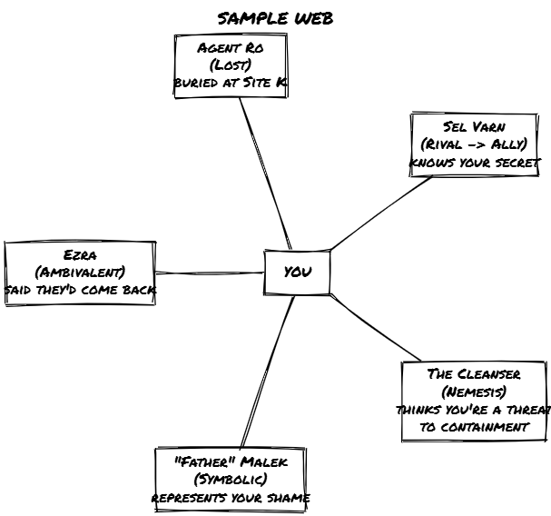
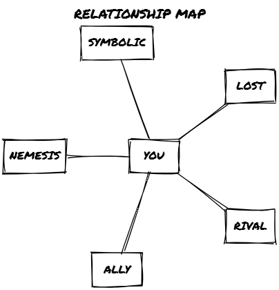

# character_builders_guide
Roberto Bisceglie
2026-09-24

# Loner 4e: Character Builder’s Guide

## Introduction

***Character Builder’s Guide*** is a supplement for *Loner* that extends
how you develop and track your Protagonist’s identity over time. It
requires the *Loner* core rules and adds nothing on top of them
mechanically: no new stats, no extra dice, no parallel systems. What it
adds are patterns, prompts, and optional frameworks for tracking the
emotional and relational texture of your solo story.

You don’t need this supplement to play *Loner*. Use it when your stories
begin asking harder questions: why did the Protagonist act that way, who
were they to this person, what did they lose, who have they become.

You won’t track health or stats here. You’ll track shifts in identity,
memory, bonds, and betrayal. The Oracle stays the same. The tags stay
the same. This supplement gives you more ways to interpret what those
tags mean, and more tools for letting them change.

### What It Is

This supplement offers:

- Lifepath generators that build characters across lost years, scarred
  events, and scattered identities.
- Tools for creating and evolving relationships with NPCs, without
  requiring journaling or extensive prep.
- Flashback, memory, and hallucination systems to enrich the inner life
  of your protagonist.
- Frameworks for changing your character’s identity over time, tied to
  their choices, regrets, and the people they meet.
- New uses of the Oracle to answer not just “What happens?” but “What
  does this mean to me?”

It is genre-agnostic, like *Loner* itself. The tools work across
settings, adding emotional and relational texture to solo play.

### What It Isn’t

This is not a solo journaling game. It doesn’t ask you to write letters
or narrate long internal monologues. It works entirely within the “tags
and dice” structure of *Loner*, expanding it sideways, not upward.

Use this supplement when the story needs a shift in tone: from tactical
to tragic, from goal-driven to self-reckoning.

It’s not about romance. That’s an option, not a default. Relationships
here are political, painful, redemptive, antagonistic, or strange. They
may deepen, sour, or reveal old secrets, but they’re never mandatory.

### How to Use This Book

There’s no strict order. The chapters are modular. Use what fits the
tone of your current story.

- Want a backstory that unfolds as you go? Use the Lifepath Tables
  alongside flashback prompts.
- Need help fleshing out companions, rivals, or lost loves? Use the
  Relationship Matrix and NPC Generator.
- Want your character to change and evolve? Use the Playing with
  Identity chapter.
- Feeling like your story needs more emotional stakes? Drop in an
  Interpersonal Scene Frame between missions.

Each chapter includes examples and optional diagrams. There are no rules
you must follow; just patterns you can adopt, if they help the story say
more.

These modules are additive, not simultaneous. Start with one. If you
only want a richer backstory, Lifepath alone is enough. Add the
Relationship Matrix when NPCs start mattering. Bring in Memory &
Flashbacks when something needs to feel haunted. You do not need all of
them running at once.

## Playing with Identity

You don’t write a backstory in *Loner*; you build it through play. This
chapter gives you a framework for revising, transforming, and discarding
tags as identity shifts, and tools for recognizing the moment something
inside you changes for good.

### Identity Is Emergent

Identity in this supplement is treated as:

- **Layered**: Characters contain contradictions. One tag might clash
  with another. That’s the point.
- **Mutable**: You can evolve, alter, or discard traits as your
  character changes.
- **Revealed**: Some parts of the character may only emerge later, a
  buried trauma, a repressed memory, a forgotten name.
- **Incongruent**: Characters are not always consistent. They lie to
  themselves. They surprise themselves. Play with that.

### Tags as Identity Markers

Tags are the heart of everything in *Loner*. Concept, Skills, Frailty,
Gear, Goal, Motive, Nemesis, none of these are stats. They’re identity
markers.

Each tag tells you something about how the character sees the world, or
how the world sees them. But tags are **not permanent**. A tag can
become obsolete. A concept can become a lie. A nemesis can become a
friend, or vice versa.

Here’s how you can treat identity tags over time:

- **Refine a tag**: Change “Mercenary” to “Regretful Mercenary” or
  “Disillusioned Veteran.”
- **Transform a tag**: Turn “Skilled Pilot” into “One-Eyed Crash
  Survivor” after a major event.
- **Replace a tag**: Swap “Hardened Skeptic” for “Shaken Believer” when
  the evidence is too much to deny.
- **Cross out a tag**: If something no longer fits, strike it. Let
  absence mean something.

A tag is worth changing when:

- A relationship flips (Rival to Ally, Ally to something worse).
- A memory breaks open or is proven false.
- You gain new scars, truths, or tools.
- The old tag has become dead weight.

When you change a tag, pick one approach:

- **Strike it**: Cross it out. Note the moment. Leave it as ghost text.
- **Rewrite it**: Evolve the wording into something more true.
- **Replace it**: Remove it entirely. Add something new.

#### 📌 Examples: Rewriting Tags

> *Skill: “Sharpshooter” becomes “Shaking Hands”* *Frailty: “Trusts the
> Wrong People” becomes “No One Left to Trust”* *Gear: “Redacted
> Dossier” becomes “Burned File, Memorized Pages”*

Use the margins of your character sheet. Draw a line through old tags.
Date changes. Add scribbled notes. Make the sheet a record of the
character’s **becoming**, not just their beginning. Don’t wait for
permission. Let the fiction demand the rewrite.

### The Core Three: Concept, Goal, Nemesis

These three tags are the **spine of identity**. They shape how your
character acts, what drives them, and what stands in their way.

But they, too, can evolve.

#### Concept

This is who the Protagonist believes they are, or wants to be. If your
actions start to contradict your Concept, that’s a sign something has
shifted. When your Concept no longer matches your behavior, rewrite it.

When to rewrite:

- After a betrayal you didn’t expect.
- After your Goal or Nemesis resolves, or mutates.
- After a flashback reframes your origin.
- After you make a choice your old self wouldn’t have.

Update the Concept when the old one becomes dishonest, or worse,
irrelevant.

##### 📌 Example: A Concept Rewritten Twice

> *“Witty Street Cat”* becomes *“Burned Informant”* after a betrayal,
> and finally *“Reluctant Martyr”* by the end.

#### Goal

Goals change. The Goal that started your story might be completed,
abandoned, or rendered impossible. When that happens, ask: *What matters
to me now?* Update the Goal tag to reflect the next chapter, not the
first.

#### Nemesis

Not all nemeses stay enemies. Some fade. Some die. Some become something
else. Track how this relationship changes. Rewrite or transform the tag
if their role in the story shifts.

##### 📌 Example: A Nemesis That Shifts

> “The Cleanser Unit” starts as *Nemesis*, but after an Oracle twist and
> a truce, you update them to *Ambiguous Ally* with the note: “Still
> dangerous.”

### Identity Checkpoints

These are moments when something inside you shifts.

Trigger an **Identity Checkpoint** when:

- You achieve or abandon your Goal.
- You forgive (or fail to).
- You break a personal rule.
- You accept a truth you’ve denied.
- You lose or reclaim a tag that defined you.

At each Checkpoint, pause. Reflect. Then ask:

- What part of me just died?
- What part of me was just born?
- What tag needs to change to reflect this?

You may rewrite multiple tags at once, or just sit with the tension.

### Marks

When you evolve, write a **Mark**: a short reflection of the new self.

A Mark can be:

- A sentence you hear in your head.
- A memory, now seen differently.
- A single line of internal narration.
- A name you no longer answer to.

#### 📌 Examples: Marks

> *“She called me a hero. I didn’t correct her.”* *“There’s blood on the
> badge now. It feels earned.”* *“This time, I didn’t flinch.”*

Collect them in a side margin or on a separate page.

### Fragmentation and Contradiction

Characters are not coherent. They are not finished. Especially not in
solo play.

Your character may:

- Contradict their tags
- Deny their motive
- Lie about their past
- Remember things that aren’t true

All of that is fair game.

Identity in *Character Builder’s Guide* is a mosaic of half-truths and
flashbacks, of lived experience and invented meaning. You are encouraged
to let your protagonist be **unreliable, evolving, and emotionally
raw**.

## The Lifepath Engine

> **Optional module.** Use this chapter to generate backstory fragments
> at character creation or during play. It requires no additional prep
> and integrates directly with the core tag system.

Backstories in *Loner* aren’t required, but they do emerge.

The Lifepath Engine generates that backstory not as a tidy summary, but
as fragments: specific events, unreliable memories, and traces of the
people who shaped you. You’ll build the self like an archaeologist: out
of scattered clues, patterns, and half-buried truths.

You can use this at character creation or mid-game, bringing lifepath
fragments into scenes through flashbacks or revelations. Every lifepath
result is a **narrative seed**, not a rule.

### How It Works

You roll on a series of d66 tables. Each table gives you a prompt: an
event, feeling, relationship, or scar.

You don’t write a biography. You collect fragments.

For each result, you can:

- Write a short note on your character sheet.
- Create a new **tag** (a Skill, Frailty, Gear, Concept detail, or even
  Nemesis).
- Leave it dangling, unresolved, something to explore later.
- Re-roll or reinterpret freely. These are poetic or symbolic prompts,
  not constraints.

You don’t need to roll on every table. Use as many as feel useful. You
can add entries mid-game as you play out flashbacks.

These tables lean toward conspiracy, anomaly, and the paranormal. For a
fantasy knight or a frontier gunslinger, reskin entries on the fly; the
emotional core of each fragment (the loss, the false memory, the
unpayable debt) survives any genre swap. The *World Builder’s Guide*
appendix on remixing D66 tables covers the technique in full.

### Table Index

- **Origins** – Where you came from, metaphorically or literally.
- **Formative Events** – What shaped you early.
- **Key Relationships** – A person or bond that still haunts or defines
  you.
- **Defining Loss** – What you lost that left a hole.
- **What Changed You** – The pivotal moment of break, shift, or
  awakening.
- **A Memory That May Be False** – Truth is flexible. Let memory play
  tricks.
- **Something You Can’t Let Go** – Obsession, guilt, or unfinished
  business.

Each table contains 36 results, rolled with d66.

### Lifepath Table: Origins (d66)

**Where did you begin, before you began?**

| d66 | Origin                                                         |
|-----|----------------------------------------------------------------|
| 11  | Raised in a forgotten place no map records.                    |
| 12  | Born during a storm that destroyed half your town.             |
| 13  | Left on a threshold with a mark on your wrist.                 |
| 14  | Grew up underground, with filtered air and no sky.             |
| 15  | Raised in a traveling group that vanished without explanation. |
| 16  | Born into silence; no one spoke until you did.                 |
| 21  | Raised by someone who wasn’t human (or wasn’t anymore).        |
| 22  | Found inside an abandoned research facility.                   |
| 23  | Born with a different name than the one you now use.           |
| 24  | Raised among believers in something long disproved.            |
| 25  | Your hometown disappeared. No one else remembers it existed.   |
| 26  | The first sound you heard was static.                          |
| 31  | You were an experiment.                                        |
| 32  | Grew up knowing you’d never belong.                            |
| 33  | Born to die for someone else’s purpose.                        |
| 34  | You have a sibling no one talks about.                         |
| 35  | Your family was erased from official records.                  |
| 36  | You were born after you died (technically).                    |
| 41  | Found floating, healthy, in a sealed chamber.                  |
| 42  | Grew up near something people weren’t supposed to see.         |
| 43  | Your birth was part of a ritual. You don’t know which part.    |
| 44  | No one remembers you as a child.                               |
| 45  | You were raised in simulations. Reality came later.            |
| 46  | Everyone you grew up with is now missing.                      |
| 51  | You remember two childhoods. You don’t know which is real.     |
| 52  | The sun didn’t rise the day you were born.                     |
| 53  | You never learned your native language.                        |
| 54  | You had a different body, once.                                |
| 55  | You were always watched. Still are.                            |
| 56  | Raised with others, like you. You’re the only one left.        |
| 61  | You escaped. From what, you still won’t say.                   |
| 62  | Adopted by those who hated you. You learned to hide.           |
| 63  | Born under a false identity. You still don’t know the truth.   |
| 64  | You were never born. You just were.                            |
| 65  | You arrived through a threshold no one else could see.         |
| 66  | You shouldn’t exist. But here you are.                         |

### Lifepath Table: Formative Events (d66)

**What shaped you before you had a choice?** These are the moments that
left marks, some visible, some not.

| d66 | Formative Event                                                       |
|-----|-----------------------------------------------------------------------|
| 11  | Witnessed someone disappear mid-sentence.                             |
| 12  | Survived a fire that no one else remembers.                           |
| 13  | Lived through a silent epidemic. You never got sick.                  |
| 14  | Your name was used in a classified incident report.                   |
| 15  | Spent a year somewhere time doesn’t work right.                       |
| 16  | Discovered a sealed room no one could explain.                        |
| 21  | Were the only one to return from an expedition.                       |
| 22  | Spoke a word you weren’t supposed to know. Everything changed.        |
| 23  | Found an object that shouldn’t exist. Kept it.                        |
| 24  | Someone trusted you with their last words. You never repeated them.   |
| 25  | Were caught in a lie that rewrote your life.                          |
| 26  | You ran. No one chased you. But you ran.                              |
| 31  | A machine said something only you understood.                         |
| 32  | Were interrogated about something you hadn’t done. Yet.               |
| 33  | You saw the sky change. You still don’t know why.                     |
| 34  | Spent months living under another name. Then forgot your own.         |
| 35  | Watched something die, then get back up.                              |
| 36  | Entered a place everyone said didn’t exist. Left a part of you there. |
| 41  | Took someone else’s place. No one noticed.                            |
| 42  | Were trained for something they claimed would never happen. It did.   |
| 43  | Found a message written in your own handwriting. It warned you.       |
| 44  | Helped someone bury something that couldn’t die.                      |
| 45  | Lost time during a family trip. No one else remembers.                |
| 46  | Were accused of something terrible. They were right.                  |
| 51  | You were chosen for something. Still don’t know what.                 |
| 52  | You vanished for three days. Returned with new scars.                 |
| 53  | Overheard something on the radio that changed your life.              |
| 54  | Lied under oath. It saved lives.                                      |
| 55  | You followed someone who didn’t know you existed. They disappeared.   |
| 56  | Saw a photo of yourself in an old case file, dated before your birth. |
| 61  | Became someone’s secret.                                              |
| 62  | Delivered something you were told never to open. You opened it.       |
| 63  | Heard a sound no one else could hear. Still do.                       |
| 64  | Found your own handwriting carved in stone. It was ancient.           |
| 65  | Helped someone forget who they were. Sometimes you wish you hadn’t.   |
| 66  | You made a choice. Everything since has been fallout.                 |

### Lifepath Table: Key Relationships (d66)

**Who shaped you, hurt you, saved you, or vanished without a trace?**
This person may be alive, dead, missing, or never real to begin with.
They might return.

| d66 | Key Relationship |
|----|----|
| 11 | Someone raised you, but never told you their name. |
| 12 | You betrayed someone who trusted you completely. |
| 13 | You had a twin. No one else remembers them. |
| 14 | An older sibling disappeared. You still wear their ID. |
| 15 | You made a promise to someone who vanished the next day. |
| 16 | You were in love once. You never saw their face. |
| 21 | A mentor taught you everything. Then erased themselves from your life. |
| 22 | Someone gave you a secret. You’ve never shared it. |
| 23 | You buried someone who died twice. |
| 24 | Someone called you “parent” once. It wasn’t a child. |
| 25 | You met someone who claimed to be your future self. You didn’t believe them. |
| 26 | You killed someone. Sometimes you dream they forgave you. |
| 31 | You were someone’s scapegoat. You played the part too well. |
| 32 | You watched someone walk into something they couldn’t return from. |
| 33 | A partner saved your life. You never thanked them. |
| 34 | You cared for someone who was never meant to exist. |
| 35 | You were part of a trio. One turned, one died. |
| 36 | Someone needed you. You left. You still hear them call. |
| 41 | Someone vanished, leaving only a recorded message: your name, repeated. |
| 42 | You once trusted someone who doesn’t even remember you now. |
| 43 | Someone wore your face, lived your life. You never found them. |
| 44 | A stranger once took a bullet for you. You never learned why. |
| 45 | You believed in someone. They destroyed everything. |
| 46 | Someone knows what you did, and keeps you alive anyway. |
| 51 | You lost someone, then found them again. They weren’t the same. |
| 52 | Someone’s waiting for you to come home. You never will. |
| 53 | Someone saved you once. You owe them something you can’t give. |
| 54 | You saw someone die. Then met them again years later. They don’t remember you. |
| 55 | Someone warned you about what you would become. You laughed. You’re not laughing now. |
| 56 | A voice on the radio calls you by a name no one else uses. |
| 61 | Someone remembers a version of your life that isn’t yours. |
| 62 | You failed someone you loved. The world blamed them. |
| 63 | You erased someone from existence. Sometimes, they almost come back. |
| 64 | Someone’s file ends where yours begins. The redacted parts overlap. |
| 65 | You were made to forget someone. It didn’t work. |
| 66 | Someone’s waiting for your story to end. Then they’ll return. |

### Lifepath Table: Defining Loss (d66)

**What did you lose that still defines you?** A person, a belief, a
piece of yourself, or something stranger. The wound hasn’t closed.

| d66 | Defining Loss                                                     |
|-----|-------------------------------------------------------------------|
| 11  | You lost your name. The one you use now is borrowed.              |
| 12  | You lost time, months, maybe years. No one will tell you how.     |
| 13  | You lost someone who depended on you. You weren’t there.          |
| 14  | You lost a place that once felt like home. It no longer exists.   |
| 15  | You lost the ability to feel something: pain, joy, cold, fear.    |
| 16  | You lost a language. You still understand it when dreaming.       |
| 21  | You lost a sibling, but not to death. To belief.                  |
| 22  | You lost the only thing that proved you were ever there.          |
| 23  | You lost a chance to forgive someone who asked too late.          |
| 24  | You lost your voice. It came back wrong.                          |
| 25  | You lost your mentor in a classified event. Their file is sealed. |
| 26  | You lost someone you never got to meet. Their absence shaped you. |
| 31  | You lost a memory that everyone else still has.                   |
| 32  | You lost a future. The life you were meant to live.               |
| 33  | You lost your reflection for several weeks. No one believed you.  |
| 34  | You lost your faith, but still follow its rituals.                |
| 35  | You lost a recording that proved the impossible.                  |
| 36  | You lost your purpose. You’re still searching for a replacement.  |
| 41  | You lost control. It cost lives.                                  |
| 42  | You lost someone to an anomaly. There was no body.                |
| 43  | You lost access to something that used to speak to you.           |
| 44  | You lost a memory on purpose. It’s starting to leak back.         |
| 45  | You lost someone you loved to your own ambition.                  |
| 46  | You lost your freedom, legally, spiritually, or metaphysically.   |
| 51  | You lost a whole identity. It may still be active.                |
| 52  | You lost the thing that made you human. Or think you did.         |
| 53  | You lost a group, a crew, a family. You made it out.              |
| 54  | You lost something inside you. Now something else is there.       |
| 55  | You lost your humanity to survive something worse.                |
| 56  | You lost hope. It hasn’t returned, but you keep moving.           |
| 61  | You lost an artifact you weren’t supposed to have.                |
| 62  | You lost someone during extraction. You never looked back.        |
| 63  | You lost part of your mind. It might have found another host.     |
| 64  | You lost your immunity. You were resistant, until you weren’t.    |
| 65  | You lost your story. Someone else is living it.                   |
| 66  | You lost everything. And then it started again.                   |

### Lifepath Table: What Changed You (d66)

**There was a before. Then there was an after.** This is the turning
point: the event that altered your trajectory forever.

| d66 | What Changed You |
|----|----|
| 11 | You saw something move where nothing should exist. |
| 12 | You touched something that responded like it knew you. |
| 13 | You killed someone who smiled as they died. |
| 14 | You were shown a secret that reshaped your memory. |
| 15 | You spoke words not meant for humans. They understood you. |
| 16 | You were left behind in a place that shouldn’t have existed. |
| 21 | You survived exposure to something that changed your DNA. |
| 22 | You entered a classified site and came out a different person. |
| 23 | You read a file that shouldn’t have been accessible. |
| 24 | You watched someone you trust be rewritten in front of you. |
| 25 | You used a device no one admitted existed. |
| 26 | You destroyed something you’d been trained to protect. |
| 31 | You crossed into somewhere. It wasn’t another country. |
| 32 | You were rescued, but not by any known force. |
| 33 | You received a transmission that’s still being decrypted. |
| 34 | You failed to contain something. It still follows you. |
| 35 | You saw your own death, and then woke up. |
| 36 | You were part of a cover-up. The truth got out anyway. |
| 41 | You walked away from a mission no one survived. Including you. |
| 42 | You heard someone calling your name through a sealed vault door. |
| 43 | You met someone who claimed to remember your future. |
| 44 | You experienced a full memory of someone else’s life. |
| 45 | You were exposed to an object that’s now classified as lost. |
| 46 | You encountered an entity that *chose* to let you live. |
| 51 | You watched a creature mimic your body perfectly. |
| 52 | You touched a mirror that didn’t reflect you. |
| 53 | You experienced a time fracture. Your scars don’t match your story. |
| 54 | You heard your own voice giving orders you never issued. |
| 55 | You destroyed evidence of something you now regret forgetting. |
| 56 | You were supposed to die. Something intervened. |
| 61 | You stopped believing the official story. Then you became part of it. |
| 62 | You witnessed reality fracture. No one else reacted. |
| 63 | You went under for a procedure. The person who woke up wasn’t fully you. |
| 64 | You were recorded saying things you never said. |
| 65 | You walked away from a loyalty you once swore by. |
| 66 | You looked into the dark. It looked back. |

### Lifepath Table: A Memory That May Be False (d66)

**You remember it. Vividly. Clearly. Too clearly.** But something’s off.
Maybe it didn’t happen. Maybe it did, but not to you.

| d66 | Memory That May Be False |
|----|----|
| 11 | You remember your own funeral. Someone cried. You think it was you. |
| 12 | You remember holding a newborn. You never had a child. |
| 13 | You remember flying without a vehicle. The air felt like glass. |
| 14 | You remember being experimented on. But not by humans. |
| 15 | You remember a building that doesn’t exist on any map. |
| 16 | You remember a name no one else will say aloud. |
| 21 | You remember watching Earth from orbit. You’ve never left the ground. |
| 22 | You remember loving someone who doesn’t appear in any records. |
| 23 | You remember a day that keeps replaying, slightly different each time. |
| 24 | You remember burning something that begged to be spared. |
| 25 | You remember a countdown. You don’t know what it was for. |
| 26 | You remember being two people at once. Neither of them you. |
| 31 | You remember a childhood in a place that couldn’t exist. |
| 32 | You remember whispering something that caused a blackout. |
| 33 | You remember an entire conversation with your nemesis. You’ve never met. |
| 34 | You remember dying. Then waking up somewhere else. |
| 35 | You remember someone else’s dream. It changed you. |
| 36 | You remember a door that should not have opened. |
| 41 | You remember setting fire to something sacred. |
| 42 | You remember a cold voice calling you by a forgotten title. |
| 43 | You remember being erased, but no one else does. |
| 44 | You remember living in a place with a second sun. |
| 45 | You remember being part of an organization you never joined. |
| 46 | You remember giving a warning you’re now trying to understand. |
| 51 | You remember a rescue that ended before it began. |
| 52 | You remember being followed by someone who claimed to be your child. |
| 53 | You remember something buried alive. It thanked you. |
| 54 | You remember carrying something alive in your chest. |
| 55 | You remember an oath. You still feel bound to it. |
| 56 | You remember someone else’s memories, better than your own. |
| 61 | You remember a place that spoke to you. Now it’s silent. |
| 62 | You remember tearing out pages from your own mind. |
| 63 | You remember a presence in the mirror, smiling. |
| 64 | You remember a team that never existed. You miss them. |
| 65 | You remember killing someone you’ve never met. |
| 66 | You remember everything. That’s what scares you. |

### Lifepath Table: Something You Can’t Let Go (d66)

**A weight you carry. A thread you keep pulling. A shadow that refuses
to fade.** This is your anchor, or your chain.

| d66 | Something You Can’t Let Go                                            |
|-----|-----------------------------------------------------------------------|
| 11  | A photo that shouldn’t exist, but does.                               |
| 12  | The last words someone said to you. You replay them constantly.       |
| 13  | A question that’s never been answered, and maybe shouldn’t be.        |
| 14  | A dream that feels more real than waking life.                        |
| 15  | A sealed envelope you refuse to open. You already know what’s inside. |
| 16  | A voice you keep hearing in certain frequencies.                      |
| 21  | A task you never finished. You’re not even sure what it was.          |
| 22  | A badge you no longer have clearance to use.                          |
| 23  | A feeling you’re being watched by someone who knows you intimately.   |
| 24  | A location that appears in every case, even if it shouldn’t.          |
| 25  | A phrase you can’t stop writing. Over and over.                       |
| 26  | A face you sketch without knowing who it belongs to.                  |
| 31  | A truth you buried so well even you forgot it. Until now.             |
| 32  | A message you deleted years ago, but it keeps showing up again.       |
| 33  | A recurring pattern in anomalous events that no one else sees.        |
| 34  | A former ally’s file. You check it monthly. Just in case.             |
| 35  | A countdown. You don’t know when it started.                          |
| 36  | An apology you never got to say.                                      |
| 41  | A mark on your skin you can’t explain, but recognize.                 |
| 42  | A memory of someone’s death. Except they’re still alive.              |
| 43  | A story that doesn’t add up. Especially the parts you told.           |
| 44  | A dream of light, followed by total silence.                          |
| 45  | A whisper in a foreign tongue. You now understand it.                 |
| 46  | A failed mission you revisit in sleep, trying to get it right.        |
| 51  | A file you shouldn’t have accessed. You kept a copy.                  |
| 52  | An artifact you hid from your own team. It calls to you.              |
| 53  | A warning etched into your gear, in your handwriting.                 |
| 54  | An event no one else recalls; you’re sure you weren’t alone.          |
| 55  | A child’s drawing you found in an abandoned site. It shows your face. |
| 56  | A name you keep seeing on gravestones, terminals, walls.              |
| 61  | A sequence of numbers that feels like a code. Or a countdown.         |
| 62  | A scar that glows in certain light.                                   |
| 63  | A feeling you failed the world, but it hasn’t noticed yet.            |
| 64  | A whisper you answered once. It hasn’t stopped.                       |
| 65  | A key you can’t identify, but are sure is important.                  |
| 66  | The possibility that none of this is real, and you’re the proof.      |

### Using Lifepaths in Play

Lifepaths matter most when you bring them into scenes: not as
exposition, but as emotional fuel, unexpected echoes, or hidden weights
that suddenly surface.

Each entry is a **loaded memory**: specific, triggerable, not a
biography summary.

#### Flashbacks

When something in the present reflects a past wound, bond, or moment of
transformation, you can flash back to a Lifepath result.

Use flashbacks when:

- You’re hesitating at a crucial decision.
- A situation feels strangely familiar.
- An NPC evokes something buried.
- You’re looking for emotional contrast or texture.

**How to flash back:**

1.  Choose or roll a Lifepath entry.
2.  Describe a quick memory: vivid, immediate, a sensory detail or a
    short exchange.
3.  Let it color your current choices or framing.

You can also ask the Oracle: **“Is this memory accurate?”** Let the
answer bend the scene.

#### Creating Tags from Fragments

**Important**: Lifepath tags do not expand your allocation. Every tag
that hardens out of a memory replaces or refines something already on
your sheet. The past rewrites the present; it does not layer on top of
it.

A Lifepath entry can evolve into a new **tag** at any time. Use this
when a memory becomes central to how you act.

You can turn a result into:

- A **Skill** (*“Survived something that broke others”* → *Nerve of
  Steel*)
- A **Frailty** (*“You remember dying”* → *Detached from Reality*)
- A **Gear** (*“You kept a file you weren’t meant to read”* → *Redacted
  Dossier*)
- A **Nemesis** (*“A partner saved your life. You never thanked them.”*
  → *Agent Hall, betrayed ally*)
- A tweak to your **Concept** or **Goal**.

These tags replace or refine what’s already there, the same process
described in Playing with Identity. A lifepath memory that hardens into
a Frailty replaces a vaguer one, or rewrites the wording of the current
one to reflect what the fiction has revealed.

There’s no timing rule. Let the fiction decide. Tags emerge when
memories harden into identity.

#### Scene Seeds

You can use a Lifepath entry to **frame a new scene**, especially Quiet
or Meanwhile scenes.

Pick a memory, and:

- Revisit it through hallucination, dream, or repressed recall.
- Introduce its consequences into the present.
- Let it parallel the current action with eerie symmetry.
- Use it to justify a contact, flaw, or habit you hadn’t explained
  before.

##### 📌 Example: Framing a Scene from a Fragment

You roll *“You failed someone you loved. The world blamed them.”*

> A scene opens with you watching news footage of someone being accused
> of treason. It’s not them. But they look like the person you lost.

#### Emotional Weight in Oracle Rolls

A Lifepath memory can influence **Advantage or Disadvantage** in a
scene.

- If the memory empowers, clarifies, or strengthens your resolve:
  **Advantage**.
- If it rattles you, casts doubt, or clouds your intent:
  **Disadvantage**.

Establish the flashback before you consult the Oracle, not after. The
memory sets the fictional position; the roll follows from it. If it
*feels* like the memory bears on the situation, let it shift the odds.
If you only thought of it once the dice were already down, treat it as
color for the narration instead.

Anchor it: a memory that shifts the dice should trace to a Lifepath
fragment or to something already established in the fiction. A memory
invented in the moment, however vivid, is color, not Advantage. The
constraint is the point; if any convenient memory could tilt any roll,
the Oracle would stop being able to surprise you.

#### Foreshadowing & Twists

You can treat certain entries as **quiet bombs**, waiting to go off. A
Lifepath entry might:

- Return in the form of a person, item, or phrase.
- Be inverted (the lost sibling comes back, but not right).
- Become a future Twist seed (*“You lost your name”* → *An entity begins
  calling you by it*).

When a Twist triggers (via the Oracle), look to your Lifepath fragments.
You’ve already planted the shadows.

#### Recurring Motifs

The *Something You Can’t Let Go* table generates a different kind of
lifepath entry. These are not memories: they are active presences. A
name on a gravestone. A message that keeps reappearing. A scar that
glows in certain light.

Use them differently from other fragments:

- **Let them recur across scenes** without forcing a resolution. Their
  power is repetition.
- When the Oracle triggers a Twist, check your “Can’t Let Go” entry. It
  may be the Twist itself.
- When you finally understand what it means, that’s an Identity
  Checkpoint.

These entries don’t resolve into tags as readily as memories do. They
may stay untagged for an entire campaign, showing up as color, dread, or
quiet wrongness. That’s their function.

#### When to Let Go

Some fragments lose power. That’s okay.

You can:

- Cross them out, noting *resolved*, *forgotten*, or *burned*.
- Let them fade until someone else reminds you.
- Re-roll, layering memory over memory.

Not every fragment stays relevant to play. But sometimes, it comes back.

## The Relationship Matrix

> **Optional module.** Use this chapter to build and track NPC
> relationships over time. It requires no additional mechanics and
> integrates with the core tag system.

The 4th edition core rules already give relationships a mechanical home:
when a connection with an NPC has been tested or deepened through play,
it earns a tag (*Trusted Informant*, *Sworn Enemy*, *Uneasy Ally*) that
functions like any other for Advantage or Disadvantage. The Relationship
Matrix builds on that foundation. It gives you a way to organize and
visualize those tags over time, tracking how roles shift and how threads
connect, without replacing the core mechanic.

Tension in solo play comes from people: not just strangers and monsters,
but the ones who know you, who shaped you, who keep showing up.

What follows is a structure for building and tracking those
relationships over time. No stats, no mechanics, just a **web of names,
roles, and emotional tags**: a record of who matters and why.

### People as Threads

Every major character your protagonist interacts with can be recorded as
a **thread**: a short entry that defines:

- **Who they are** (a name and a brief descriptor)
- **What role they play**
- **What emotional or thematic tags define your bond**

This is a minimalist character record, but it holds weight. These people
return. They shape how you act. Sometimes, they break you.

### Roles

Each person in the matrix begins with a **role**. Roles aren’t
permanent; they drift. But they shape how the relationship feels *now*.

| Role | Description |
|----|----|
| **Ally** | Supports you, shares your mission or cares for you. |
| **Rival** | Competes with you, challenges your skills or beliefs. |
| **Nemesis** | Seeks to undermine or destroy you. Your reflection in a cracked mirror. |
| **Lost** | Gone, missing, presumed dead, or simply unreachable. |
| **Ambivalent** | Complicated. Neither friend nor foe. Maybe both. |
| **Symbolic** | Represents something bigger: a faith, a regret, a future you won’t reach. |

You can shift roles anytime fiction supports it. A Nemesis can become an
Ally. A Symbol can become a threat.

The first five roles describe relational stances: how this person stands
toward you right now. Symbolic describes a narrative function: this
person represents something larger than themselves. Any role can carry
symbolic weight. Use Symbolic when that narrative function is the
primary thing defining the relationship, not as a modifier added to Ally
or Rival.

If an NPC already appears as the Protagonist’s Nemesis tag on their
character sheet, the Matrix entry and the tag describe the same
relationship at different scales. The tag handles fictional positioning:
when it bears on a situation, it grants Advantage or Disadvantage. The
Matrix entry tracks the relationship’s texture, how it started, what’s
shifted, what it might become. If the Protagonist’s Nemesis tag is later
removed or transformed, update the Matrix entry to reflect the new role;
the tag and the Matrix entry describe the same relationship and should
stay consistent.

### Tags That Define the Bond

Each relationship carries 1–3 **tags** that describe the bond.

These can be:

- **Emotional** (*unspoken guilt, jealous admiration, old flame*)
- **Situational** (*owed a favor, witnessed your worst moment, betrayed
  once*)
- **Narrative** (*knows your secret, believed the prophecy, left behind
  in the breach*)

You can create tags when you:

- Introduce a new contact.
- Re-encounter someone from your past.
- Flash back to a memory.
- Feel the bond shift.

**Tags evolve**. Add new ones. Cross out old ones. Watch the web tangle.

### Sample Relationship Entry

> **Name:** Sel Varn\
> **Role:** Rival → Ally\
> **Tags:** shared a past mission / knows your weakness / never forgave
> you

You met Sel during a failed containment op. You were both blamed. She
went silent. You’ve seen her file flagged as “Active, Unaffiliated.”
Then she showed up again, this time with backup.

What now?

### Drift & Mutation

People change. Roles shift.

At any point in play, you can reassign a role or evolve a tag,
especially after:

- A major decision involving them.
- A scene where the relationship is tested.
- A twist that alters how you see them.
- A memory that contradicts what you thought was true.

You can ask the Oracle: **“Has our relationship changed?”** Let the dice
complicate things. Maybe it hasn’t. Maybe it has in a way you didn’t
expect.

### Echoes and Returns

Relationships don’t stay in the past. People return:

- In dreams
- Through intercepted messages
- As enemies on a new case
- In someone else’s words or face

Use the **Twist** mechanic to trigger a return:

- *A third party appears?* It’s them.
- *An emotional event changes the goal?* It’s tied to them.

Each time they return, update the matrix. Let the web evolve.

### Sample Web

## The NPC Depth Generator

> **Optional module.** Use this chapter to build and enrich NPCs that
> carry emotional and narrative weight. It requires no additional
> mechanics.

Not every NPC matters. But the ones who do shape your story, sometimes
more than you do.

What follows are fast tools for building NPCs that carry weight in the
story. No stats, no blocks, just tags, roles, and intent.

Before investing in a full NPC entry, the core rules offer a simple
test: if someone matters once, keep them as plain tags in the scene. If
they keep showing up or actively push back against the Protagonist, that
is when they earn a sheet. This chapter is for those characters, the
ones the fiction has already promoted.

### Quick NPC Recipe

Every NPC needs just four elements:

- **Name** – evocative, memorable, or deliberately vague.
- **Concept** – 3–5 words: role, tone, history.
- **Tags** – 1–3 emotional, situational, or thematic descriptors.
- **Want** – what they want from you. Not abstract; personal.

You can write them in one line:

> **Ezra Vale** – former field partner, surgically calm, deeply
> compromised *Tags*: buried past / trusts you too much / haunted by
> something *Wants*: redemption or silence

### NPC Archetype Categories

Use these as starting points or lenses. Each comes with typical themes
and tensions.

#### Companion

- Fights beside you, or follows at a distance.
- Can be a partner, assistant, child, synthetic, dog.
- May leave or die or betray you, or stick it out.

##### 📌 Example: A Companion

> *Tags*: loyal to a fault / owes you / hiding a wound *Wants*:
> survival, guidance, to matter

#### Antagonist

- Doesn’t just oppose you; opposes your way of doing things.
- May be righteous, even justified.
- Could know you better than you know yourself.

##### 📌 Example: An Antagonist

> *Tags*: mirrors your flaws / cold precision / personal vendetta
> *Wants*: to prove you wrong, to see you fall

#### Authority

- Has power over your mission, movement, or memory.
- May issue orders, revoke access, or offer impossible choices.
- Can shift to ally, rival, or symbol.

##### 📌 Example: An Authority

> *Tags*: by the book / manipulative / has a file on you *Wants*:
> control, loyalty, silence

#### Shadow Self

- You, if you’d chosen differently.
- Embodies a path you fear, desire, or try to forget.
- Shows up at the worst time, or the most honest.

##### 📌 Example: A Shadow Self

> *Tags*: same skillset / opposite motive / unpredictable *Wants*: to
> confront you, become you, break the mirror

#### Ghost

- May be dead. Or just lost.
- Appears in flashbacks, echoes, hallucinations.
- Still shaping you. Especially when you pretend they’re not.

##### 📌 Example: A Ghost

> *Tags*: unfinished business / voice in your ear / no closure *Wants*:
> forgiveness, release, return

#### Mirror

- A stranger who understands too much.
- Reflects a truth you’re trying to ignore.
- May be harmless. May not be real.

##### 📌 Example: A Mirror

> *Tags*: eerie resemblance / too familiar / unknowable *Wants*:
> contact, empathy, an answer

**When to choose between Shadow Self and Mirror**: Use Shadow Self when
you know how they became what they are: their path is legible, just
different from yours. Use Mirror when you don’t: something about them is
illegible, and that illegibility is the point.

### What They Want (d6 Table)

When in doubt, roll to define the NPC’s core drive in relation to the
protagonist.

| d6  | They Want…                                             |
|-----|--------------------------------------------------------|
| 1   | The truth: from you, about you, or hidden inside you.  |
| 2   | Redemption: for themselves or for what you did.        |
| 3   | Destruction: of you, or what you represent.            |
| 4   | Connection: they need something only you can give.     |
| 5   | Control: they want you as an asset, pawn, or project.  |
| 6   | Closure: they’re here to finish what started long ago. |

This **want** shapes every scene they’re in.

### Bonus: Minimal NPC Sheet

> **Name:**\
> **Concept:**\
> **Role:** (Companion, Nemesis, etc.)\
> **Tags:**\
> **Want:**\
> **Bond to You:** (What they know, what they remember, what they
> regret)

## Evolving Bonds in Solo Play

> **Optional module.** Use this chapter to track how NPC relationships
> change over time in response to story events.

In solo play, relationships are memory traces until they change.

A single ally can carry an entire subplot. A bitter rival can become a
tragic echo. A long-lost contact can return twisted, unknowable, or
simply tired. These arcs don’t unfold automatically. They react to the
weight of scenes, choices, and silence.

What follows are tools to track how bonds shift as the story moves.

### Measuring Growth

You don’t need points, meters, or trust levels. Growth happens when:

- A tag no longer fits.
- A role feels out of date.
- A character returns changed, or you do.
- A memory is reframed or disproven.

Let those moments prompt a rewrite.

**Update the Relationship Matrix** *(see Relationship Matrix for the
full entry format)*:

- Shift a Role (Rival → Ally, Nemesis → Lost).
- Strike through a tag. Add a new one.
- Annotate dates or key events.

Your matrix should look **tangled, overwritten, alive**.

### Relationship Arcs

Relationships don’t need to stay fixed. Use the tables below to morph
the bond after key story beats.

#### Reconciliation (d6)

| d6  | What Changed                             |
|-----|------------------------------------------|
| 1   | You saved them. They didn’t expect it.   |
| 2   | You apologized. Even if they didn’t.     |
| 3   | You confessed what really happened.      |
| 4   | A shared enemy brought you together.     |
| 5   | They admitted they were wrong.           |
| 6   | Neither of you spoke. But it was enough. |

#### Regret (d6)

| d6  | What Hurts                                |
|-----|-------------------------------------------|
| 1   | You told the truth too late.              |
| 2   | You watched them walk away. You let them. |
| 3   | They believed you. They shouldn’t have.   |
| 4   | You broke something they never replaced.  |
| 5   | You never said what mattered.             |
| 6   | You chose the mission. They paid for it.  |

#### Betrayal (d6)

| d6  | How It Broke                                  |
|-----|-----------------------------------------------|
| 1   | They used your trust to get what they wanted. |
| 2   | You lied. They knew it.                       |
| 3   | You reached out. They recoiled.               |
| 4   | They played both sides. You were the cost.    |
| 5   | You hesitated. They didn’t.                   |
| 6   | They knew the truth, and let you suffer.      |

Use these after scenes with emotional weight. Let the result inform the
new **tags**, **tone**, and future flashbacks.

### NPC Arcs as Solo Subplots

Every major NPC can carry a full arc, even if they never appear again.

You can build arcs from:

- One early encounter + three echoes
- Lifepath memories + current choices
- A twist + unresolved tension

#### 📌 Example Arc: Agent Ro (Ally → Lost → Symbolic)

- Mission 1: Trusted mentor, silent type.
- Mission 2: Goes missing in the breach.
- Flashback: He once said, “Don’t come looking.”
- Later: You find his badge sealed in a paradox vault.
- Final Tag: *Still watching / Never left / Part of the breach*

### Thematic Arc Templates

You can use these as mini-frameworks for roleplay across multiple
scenes:

#### Mentor / Student

Start as trusted guide and eager follower. Shift when one surpasses the
other, or when faith fails.

> Scene Beat: The student knows something the mentor is afraid to face.

#### Rival / Friend

Compete, clash, admire, push each other further. Ends in victory,
collapse, or uneasy respect.

> Scene Beat: One saves the other without claiming credit.

#### Exile / Homecoming

Someone once cast out or left behind. Return creates rupture or healing.

> Scene Beat: You pretend not to recognize each other. You both know.

#### Stranger / Mirror

They appear as a blank slate. Later, you realize they reflect you:
before, after, or never.

> Scene Beat: They say something only you were supposed to know.

## Memory & Flashbacks

> **Optional module.** Use this chapter to bring past events into
> present scenes through structured flashbacks and unreliable memory.

The past isn’t gone. It just waits for the right moment to resurface.

*Loner* always moves forward, but who you were still matters. Flashbacks
are how you return to a key moment: to understand a motive, reveal a
buried truth, or introduce unreliability into the fiction.

Memories aren’t passive. They interrupt. They demand attention.
Sometimes they lie.

### When to Use a Flashback

You can flash back whenever:

- A decision echoes something unresolved.
- A place, sound, or NPC triggers déjà vu.
- You need to justify a tag, trait, or fear.
- You want to explore what shaped your current action.

There are no rules for this. Just instinct. Let the fiction suggest:
*What do I remember right now, and why?*

### Flashback Format

Flashbacks don’t need to be long.

- 1–3 sentences is enough: a voice, a scene, a single striking detail.
- Focus on **emotion and tension**, not exposition.
- You can narrate them out loud, jot them on your character sheet, or
  just say “I remember…”

#### 📌 Example: A Flashback Mid-Scene

> You hesitate before shooting. You flash back to a child’s voice: “You
> promised you wouldn’t be like them.”

### Memory Triggers (d6)

When you want a flashback but don’t know what, roll 1d6:

| d6  | Trigger                                                             |
|-----|---------------------------------------------------------------------|
| 1   | A sound echoes something long forgotten.                            |
| 2   | A phrase or face feels familiar, but wrong.                         |
| 3   | A smell puts you somewhere you swore you’d never go back to.        |
| 4   | You act without thinking, and realize you’ve done this before.      |
| 5   | A scar itches. The memory returns in pieces.                        |
| 6   | You see yourself, just for a moment, doing something you never did. |

Pair with a Lifepath entry, or invent freely. These are **snapshots**,
not monologues.

### Unreliable Memory

Not all memories are true. Some are:

- **Edited** (changed by trauma, time, or manipulation)
- **Symbolic** (representing something real, but not literally)
- **Implanted** (by others, or by your own survival instinct)

You can always ask:

**“Is this memory accurate?”** Roll the Oracle.

| Oracle Result | What It Means                                          |
|---------------|--------------------------------------------------------|
| **Yes, and…** | It happened. It changed something you hadn’t realized. |
| **Yes**       | It happened. It still matters.                         |
| **Yes, but…** | It happened, but not the way you thought.              |
| **No, but…**  | It’s false, but the feeling it gave you was real.      |
| **No**        | It’s false. You were wrong.                            |
| **No, and…**  | Someone made you remember it this way. Why?            |

It can change how you treat allies, trust evidence, or reframe your
goals.

### Using Flashbacks in Play

**Timing rule**: Establish a flashback *before* you consult the Oracle,
not after. The memory sets the fictional position; the roll follows from
it. A flashback invoked only to explain a result you didn’t like is
narration, not positioning: treat it as color, not Advantage. The same
goes for provenance: a flashback that shifts the dice should anchor to a
Lifepath fragment or established fiction, not be invented for the roll.

Flashbacks can:

- Justify or evolve a tag.
- Shift your stance toward an NPC.
- Add emotional cost to a success.
- Reshape your Concept or Frailty.
- Trigger a Twist (especially when the Twist Counter is one step from
  firing).

They’re not mandatory. But when used well, they make solo play feel
*haunted*.

### Optional: False Memory Table (d6)

If the Oracle says a memory is false, you can roll to interpret how:

| d6  | What’s Wrong With It                                     |
|-----|----------------------------------------------------------|
| 1   | It’s someone else’s memory, imprinted on you.            |
| 2   | You were made to believe it, for your own good.          |
| 3   | It’s symbolic, standing in for something far worse.      |
| 4   | You wanted it to be true, so you made it real.           |
| 5   | It was altered: edited by technology, ritual, or trauma. |
| 6   | It never happened, but it’s happening now.               |

Let the new truth ripple outward. Update the Relationship Matrix. Shift
your tags. Ask what else might be false.

## Interpersonal Scene Frames

> **Optional module.** Use this chapter to add scenes focused on
> relationships rather than action. These work as Quiet scene variants
> between or during missions.

These frames work inside *Loner*’s standard scene structure. Frame the
interpersonal moment using the same three questions (Where is the
Protagonist, Who is present, What does the Protagonist intend?) and let
the frame below define the emotional content rather than a tactical
goal.

Not every scene has to be about the mission.

Sometimes, the most memorable moments come when the action pauses: when
someone says too much, or not enough; when an old wound reopens; when
the past finally catches up.

**Interpersonal Scene Frames** give you personal scenes to drop in
during or between missions. They shift relationships, test loyalties,
and let silence matter as much as action.

### What Is a Scene Frame?

A **scene frame** is a prompt that says: **“Something personal happens
here.”**

It might be:

- A confrontation you’ve been avoiding.
- An unexpected confession.
- A moment of quiet vulnerability.
- A betrayal in progress.

Frames can be inserted:

- At the start or end of a scene.
- As an unexpected twist mid-action.
- In downtime or transit.
- During a Twist result (especially for *emotional event* outcomes).

You can choose or roll from the tables below.

### Confessions (d6)

| d6  | Frame                                                                |
|-----|----------------------------------------------------------------------|
| 1   | They tell you something they were never supposed to admit.           |
| 2   | You confess something no one else has heard.                         |
| 3   | An NPC confesses, then asks if you believe them.                     |
| 4   | A memory you’ve been hiding slips out under pressure.                |
| 5   | Someone mistakes you for someone you used to be, and you play along. |
| 6   | You say what you’ve been rehearsing for years. Too late.             |

### Confrontations (d6)

| d6  | Frame                                                       |
|-----|-------------------------------------------------------------|
| 1   | They accuse you of something you did. Or didn’t do.         |
| 2   | You confront someone who wronged you. They’re not sorry.    |
| 3   | You’re forced to choose sides, and someone notices.         |
| 4   | An ally demands answers. You don’t have them.               |
| 5   | Someone lashes out. The words cut deeper than intended.     |
| 6   | The person you blame finally shows up. And they’re changed. |

### Bonds Deepening (d6)

| d6  | Frame                                                  |
|-----|--------------------------------------------------------|
| 1   | You save someone. You see who they really are.         |
| 2   | They offer you trust. More than you deserve.           |
| 3   | You share something you never told anyone.             |
| 4   | A shared silence becomes something more.               |
| 5   | They remember something about you that you forgot.     |
| 6   | You realize you’re willing to risk something for them. |

### Betrayals Unfolding (d6)

| d6  | Frame                                                  |
|-----|--------------------------------------------------------|
| 1   | They lie. You realize it halfway through.              |
| 2   | You were never supposed to hear that. But you did.     |
| 3   | Someone you’ve protected turns you in.                 |
| 4   | They knew all along. About the mission. About you.     |
| 5   | You walk into a trap. You recognize the bait.          |
| 6   | You catch yourself betraying them. And you keep going. |

### Injecting a Relationship Scene Without Derailing Play

You can insert a Relationship Frame:

- **Before** a high-stakes scene → raise the emotional cost.
- **During** a scene → mid-mission dialogue, passive-aggressive silence,
  confession under fire.
- **After** a scene → as fallout, relief, or quiet reflection.

**Keep it short and sharp.** A single line of dialogue can shift the
whole arc.

Use these frames to:

- Reinforce or challenge your relationship tags.
- Shift Roles in the Relationship Matrix (Ally → Rival, etc.).
- Set up flashbacks or foreshadowing.
- Add weight to future betrayals or sacrifices.

### Genre Variations (Optional)

You can tilt these frames to match the tone of your world:

#### Spy Fiction

- “She’s not supposed to be alive, but she’s here.”
- “The voice on the comm is familiar. Too familiar.”

#### Cosmic Horror

- “He says you were with him in the rift. You weren’t.”
- “You can’t tell if they’re still human. Or if you are.”

#### Fantasy

- “The tattoo matches yours. From a ritual you never completed.”
- “He speaks your name in an old tongue. You remember it.”

#### Sci-Fi

- “She claims to be your clone. You don’t believe her. Yet.”
- “The AI refers to a shared memory you didn’t input.”

## Appendix: Visual Tools

> **Optional module.** These templates help you track identity,
> relationships, memory, and growth across sessions.

Not everything needs to be written in long form. Some truths are best
diagrammed, mapped, or drawn in the margins.

Use these pages however you want. Print them, sketch over them, crumple
and rewrite. These aren’t records. They’re *evidence*.

*Loner* is minimalist by design, but the space around your Protagonist
can be full of threads, maps, stains, and patterns. These tools help you
see the shape of the story as it emerges, and sometimes, as it
fractures.

### Relationship Map Template

A simple radial layout:

Each spoke is a Role. Each node contains: Name, 1–2 tags, optional
notes.

Update arrows as roles shift. Circle names when they’re active in a
current scene. Cross them when bonds break.

### Character Web Diagram

Divide a blank page into four quadrants. Write your Protagonist’s
current Concept in the center. In each quadrant, place one category:

- Top-left: Lifepath fragments still active
- Top-right: Tag mutations (old tag → new tag)
- Bottom-left: Flashback anchors (recurring memories)
- Bottom-right: Open threads (unresolved relationships, dangling
  lifepath entries)

Draw lines between items that caused each other. The web grows as the
story grows.

### Lifepath Sheet

| Type | Fragment | Tag (Optional) | Flashback? |
|----|----|----|----|
| Origin | “Raised in a place no map records” | *Ghost Childhood* | ✅ |
| Event | “Watched someone walk into something they couldn’t return from” | \- | ✅ |
| Loss | “Lost a memory on purpose” | *Erased Name* | \- |

Keep it loose. Add notes, symbols, or timelines. Fragments you resolve
can be struck through. False memories can be flagged: `(?)`

### Evolution Wheel

Track each major identity change as a row. Add one row per Identity
Checkpoint.

| \#  | Concept   | Goal      | Nemesis   | Frailty   | Checkpoint | Mark |
|-----|-----------|-----------|-----------|-----------|------------|------|
| 1   | \[start\] | \[start\] | \[start\] | \[start\] | \-         | \-   |
| 2   |           |           |           |           |            |      |
| 3   |           |           |           |           |            |      |

Leave cells blank when a tag didn’t change. Write the new value when it
does. You can note an arrow (→) between old and new values in the same
cell if you want to show the direction of the shift.

## License

Loner 4e: Character Builder’s Guide

© 2026 Roberto Bisceglie

This work is licensed under the Creative Commons Attribution-ShareAlike
4.0 International License. To view a copy of this license, visit
http://creativecommons.org/licenses/by-sa/4.0/ or send a letter to
Creative Commons, PO Box 1866, Mountain View, CA 94042, USA.
